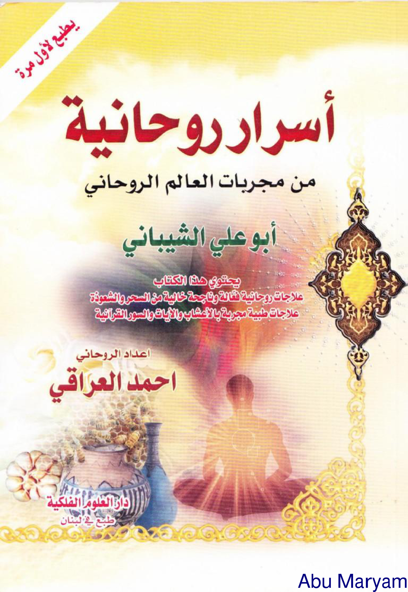

# BATCH 01 — Halaman PDF 1–5 (= Sampul muka · cetak 7 · cetak 9 · cetak 10 · cetak 11)

**Kitab:** أسرار روحانية من مجربات العالم الروحاني أبي علي الشيباني — إعداد: الروحاني أحمد العراقي — دار العلوم الفلكية، طبع في لبنان.
**Standar edisi ini:** (1) Teks Arab asli utuh sebagaimana tercetak; (2) transliterasi Latin fonetik **washal ulama** penuh — tanpa dipotong — (idgham syamsiyah: *asy-, ar-, ats-,…*; vokal akhir kata disambungkan ke *al-*: *minal-, fil-, bil-, lil-, lisy-, wallaahu* dst. — dibaca sebagaimana dibunyikan); (3) **terjemah matan murni** (makna utuh, tanpa penjelasan bertele-tele); (4) potongan rajah/wafaq/tilsam 300 DPI latar putih; (5) telaah filologi singkat.

> **Catatan pembacaan:** semua langkah teknis amalan (menulis, membakar, meminum, mengikat azimat) disalin **sebagai data naskah**, bukan anjuran untuk diamalkan — wasiat umum kitab: *لا تستعملوه إلا في ما يرضي الله* — «jangan mempergunakannya kecuali untuk apa yang diridhai Allah» — dan kaidah *لا ضرر ولا ضرار* (tidak boleh memudaratkan diri atau orang lain).

---

## Halaman PDF 1 — sampul muka (tidak bernomor halaman)

**Teks Arab asli (dari atas ke bawah):**

> (di pojok, tulisan miring) **يُطْبَعُ لأَوَّلِ مَرَّة**
> **أَسْرَارُ رُوحَانِيَّة**
> مِنْ مُجَرَّبَاتِ الْعَالَمِ الرُّوحَانِي
> **أَبُو عَلِيّ الشَّيْبَانِي**
> يَحْتَوِي هَذَا الْكِتَابُ عَلَى تَرَاكِيبِ رُوحَانِيَّةٍ مُفِيدَةٍ مُجَرَّبَةٍ خَالِيَةٍ مِنَ السِّحْرِ وَالشَّعْوَذَةِ، عِلَاجَاتٍ طِبِّيَّةٍ مُجَرَّبَةٍ بِالْأَعْشَابِ وَالْآيَاتِ وَالسُّوَرِ الْقُرْآنِيَّةِ.
> إِعْدَادُ الرُّوحَانِي — **أَحْمَدُ الْعِرَاقِي**
> **دَارُ الْعُلُومِ الْفَلَكِيَّة — طُبِعَ فِي لُبْنَان**

**Transliterasi washal (dibunyikan sambung):**

* Yuthba'u li-awwali marrah.
* Asraaru ruuhaniyyah — mim mujarrabaatil-'aalamir-ruuhanii — **Abuu 'Aliyisy-Syaibaanii**.
* Yahtawii haadzal-kitaabu 'alaa taraakiiba ruuhaniyyatim mufiidatim mujarrabatin khaaliyatim minas-sihri wasy-sya'wadzati — 'ilaajaatun thibbiyyatum mujarrabatum bil-a'syaabi wal-aayaati was-suwaril-qur-aaniyyah.
* I'daadur-ruuhanii — **Ahmadul-'Iraaqii**.
* **Daarul-'Uluumil-Falakiyyah — thubi'a fii Lubnaan.**

**Terjemahan matan murni:**

Dicetak untuk pertama kalinya. **Rahasia-rahasia Rohani** — dari amalan-amalan teruji (mujarrabat) alam rohani, **Abu Ali asy-Syaibani**. Buku ini memuat ramuan-ramuan rohani yang bermanfaat dan teruji, bersih dari sihir dan perdukunan; juga pengobatan-pengobatan medis teruji dengan tumbuhan, ayat-ayat, dan surah-surah Al-Qur'an. Penyusun: ar-Ruhani — **Ahmad al-Iraqi**. **Darul-Ulum al-Falakiyyah — dicetak di Lebanon.**

**Telaah filologi:** runtun judul memakai *min* partitif («dari antara mujarrabat…»); pengarang dilebeli "al-Iraqi" dan penerbit beralamat Lebanon — potret jalur penerbitan kitab populer Irak–Beirut. Gambar sampul: matahari, vas, kendi, siluet duduk bersila — khas sampul terbitan populer ruhani.

---

## Halaman PDF 2 (= cetak 7)

### Bab: طِلْسَمٌ فَعَّالٌ وَمُجَرَّبٌ لِإِزَالَةِ الْعَارِضِ

**Latin washal judul:** *Thilasmun fa''aalun wa mujarrabun li-izaalatil-'aaridh* — «Tilsam yang amat ampuh dan teruji untuk menghilangkan 'arid (gangguan ruhani yang menimpa)».

**Teks Arab asli:**

> يُكْتَبُ هَذَا الطِّلْسَمُ بِقَلَمٍ أَسْوَدَ عَلَى قِطْعَةِ قُمَاشٍ بَيْضَاءَ مِنْ مَلَابِسِ الشَّخْصِ الْمُصَابِ وَتُحْرَقُ هَذِهِ الْقِطْعَةُ كَيْ يَتَبَخَّرَ بِهَا.

**Transliterasi washal:** *Yuktabu haadzath-thilasmu biqalamin aswada, 'alaa qith'ati qumaasyim baidhaa'a mim malaabisisy-syakhshil-mushaabi, wa tuhraqu haadzihil-qith'atu kai yatabakhkhara bihaa.*

**Terjemahan matan murni:** Ditulis tilsam ini dengan pena hitam, pada sepotong kain putih dari pakaian orang yang terkena (musibah/gangguan); lalu dibakar potongan kain itu agar orangnya terasapi oleh asapnya.

**Teks tawakkal di sisi wafaq (Arab asli):**

> تَوَكَّلُوا يَا خُدَّامَ هَذَا الطِّلْسَمِ وَأَزِيلُوا هَذَا الْعَارِضَ فِي جَسَدِ فُلَانِ بْنِ فُلَانَةَ. أُقْسِمُ عَلَيْكُمْ بِحَقِّ الْمَلِكِ الأَعْلَى الْمُسَيْطِرِ عَلَيْكُمْ.

**Transliterasi washal:** *Tawakkaluu yaa khuddaama haadzath-thilasmi wa aziiluu haadzal-'aaridha fii jasadi fulaanibni fulaanah. Uqsimu 'alaikum bihaqqil-malikil-a'lal-musaythiru 'alaikum.*

**Terjemahan matan murni:** «Kerjakanlah (perintahku), wahai para pelayan (khadam) tilsam ini, dan hilangkanlah gangguan ('arid) ini dari tubuh Fulan anak Fulanah. Aku bersumpah atas kalian demi hak Raja Yang Mahatinggi yang menguasai kalian.»

**Data wafaq ربيع (4×4), dibaca dari kanan ke kiri:** (١، ١٥، ١٣، ٣) / (١٣، ٦، ٧، ٩) / (٨، ١٠، ١١، ٥) / (١٢، ٣، ٣، ١٦). Angka terpisah pada busur kanan rajah: **و١٣٢٢ \ ٣٤٥**. Lambang: dua matahari bercahaya, sepasang mata dalam oval, dan satu baris **huruf rajah yang tidak terbaca** (ditandai, tidak diterjemahkan sembarangan — bentuk aslinya pada foto).

**Telaah filologi:** «فلان ابن فلانة» adalah pengganti nama (seperti «si Anu bin Anu» — pola azimat Syam/Irak); kata **خُدَّام** (khodam) terminologi ruhani rakyat; wafaq bukan wafq mizani sempurna (kolom-baris tak semua berjumlah sama) — ciri ketanggaran penyalinan kitab populer.

---

## Halaman PDF 3 (= cetak 9)

### Bab: لِلْمَوَدَّةِ وَالْمَحَبَّةِ بَيْنَ النَّاسِ

**Latin washal judul:** *Lil-mawaddati wal-mahabbati bainan-naas* — «Untuk (menumbuhkan) kasih-sayang dan kecintaan di antara manusia».

**Teks Arab asli:**

> تُكْتَبُ عَلَى قَالِبٍ مِنَ الثَّلْجِ بِقَلَمٍ بِدُونِ حِبْرٍ الْآتِي: **سَلَامٌ قَوْلًا مِنْ رَبٍّ رَحِيمٍ (﴿)، سَلَامٌ عَلَى آلِ يَاسِينَ** (٩) مَرَّاتٍ، **يَا نَارُ كُونِي بَرْدًا وَسَلَامًا**، **وَأَلْقَيْتُ عَلَيْكِ مَحَبَّةً مِنِّي.**
>
> وَبَعْدَ ذَوَبَانِ هَذَا الثَّلْجِ تَشْرَبُ مِنْهُ.

**Transliterasi washal:** *Tuktabu 'alaa qoolibin minats-tsalji biqalamin biduuni hibrinil-aatii: **Salaamun qaulam mir-robbir-rohiim** — **Salaamun 'alaa aali Yaasiin** (dibaca 9 kali) — **yaa naaru kuunii bardaw-wa salaamaa** — **wa alqaitu 'alaiki mahabbatan minnii.** Wa ba'da dzawaabaani haadzats-tsalji tasyrabu minhu.*

**Terjemahan matan murni:** Ditulis pada bongkahan es dengan pena tanpa tinta, bacaan berikut ini: «"Salam!", sebagai ucapan dari Tuhan Yang Maha Penyayang» (QS. Yaasiin: 58); «keselamatan atas keluarga Yaasiin» — sembilan kali; «Wahai api, jadilah engkau yang dingin dan membawa keselamatan» (QS. al-Anbiyaa': 69); «dan Kami limpahkan kepadamu kasih-sayang dari sisi-Kami» (QS. Thaahaa: 39). Setelah es itu mencair, diminumlah dari (air)nya.

### Bab: مُجَرَّبَةٌ فَعَّالَةٌ جِدًّا لِلْعِزَّةِ عَلَى الظَّالِمِ

**Latin washal judul:** *Mujarrabatun fa'aalatun jiddal lil-'izzati 'alazh-zhoolimi* — «Perkara teruji, amat ampuh, untuk kewibawaan ('izzah) atas orang yang zalim».

**Teks Arab asli:**

> تَقُولُ (٤٠٠٠) مَرَّةً فِي السَّاعَةِ الْوَاحِدَةِ بَعْدَ مُنْتَصَفِ اللَّيْلِ وَلِمُدَّةِ أُسْبُوعٍ كَامِلٍ: **(وَمَنْ مِثْلِي، وَأَيْنَ يَكُونُ مِثْلِي، وَلَيْسَ يَكُونُ فَأَطْلُبْنِي تَجِدْنِي).**

**Transliterasi washal:** *Taquulu — arba'a aalaafi — marratan fis-saa'atil-waahidah, ba'da muntashafil-laili, wa limuddati usbuu'in kaamil: **wa mam-mitslii, wa aina yakuunu mitslii, wa laisa yakuunu, fathlubunii tajidunii.***

**Terjemahan matan murni:** Engkau membaca 4000 kali dalam satu putaran jam sesudah tengah malam, selama satu pekan penuh: «Siapakah yang seperti Aku? Di manakah ada yang seperti Aku? Tidak ada yang seperti (Aku) — maka carilah Aku, pasti engkau menemukan Aku.»

**Telaah filologi:** deretan «سلام على آل ياسين» adalah serupun doa salam populer Irak–Syam (varian dari «سلام على آل يس» في الراتب); bacaan «wamam-mitslii…» adalah ragam «pencarian Ism A'zam» khas majmu'ah doa rakyat — direkam sebagai data teks, bukan petunjuk praktik.

---

## Halaman PDF 4 (= cetak 10) — *lihat catatan koreksi urutan pindaian*

### Bab: الغَنَى

**Latin washal judul:** *Al-Ghanaa* — «Kecukupan (terangkatnya kefakiran menuju berkecukupan)».

**Teks Arab asli:**

> تَقْرَأُ هَذَا الدُّعَاءَ: **يَا مُعِيدُ إِذَا بَرَزَ الْخَلَائِقُ مِنْ دَعْوَتِهِ مِنْ مَخَافَتِهِ، يَا ذَا الْمَعْرُوفِ الَّذِي لَا يَنْقَطِعُ. اللَّهُمَّ دُلَّنِي عَلَى كَرِيمِ غَيْرِكَ، اللَّهُمَّ دُلَّنِي عَلَى عَظِيمِ غَيْرِكَ وَكُلُّ شَيْءٍ بَيْنَ يَدَيْكَ.**
>
> ثُمَّ تَقْرَأُ (سُورَةَ مَرْيَمَ) بِأَكْمَلِهَا وَتُهْدِيهَا إِلَى السَّيِّدَةِ مَرْيَمَ بِنْتِ عِمْرَانَ (ع).

**Transliterasi washal:** *Taqra'u haadzad-du'aa'a: **Yaa Mu'iidu idzaa barazal-kholaa'iqu min da'watihii min makhaafatihii — yaa dzal-ma'ruufil-ladzii laa yanqathiy'. Allaahumma dullanii 'alaa kariimin ghoiruka — Allaahumma dullanii 'alaa 'azhiimin ghoiruka, wa kullu syai'im baina yadaika.*** Lalu *tsumma taqra'u — suuratu Maryam — bi-akmalihaa wa tuhdiihaa ilas-Sayyidati Maryamab-nati 'Imraan ('alaihas-salaam).*

**Terjemahan matan murni:** Bacalah doa ini: «Wahai Yang Mengembalikan — tatkala segala makhluk nanti terbangkit oleh panggilan-Nya karena saking takutnya kepada-Nya — wahai Pemilik perbuatan baik yang tak pernah putus. Ya Allah, tunjukilah aku kepada kemurahan-hati-Mu yang tak ada bandingnya dengan selain-Mu; ya Allah, tunjukilah aku kepada keagungan yang bukan milik selain-Mu, padahal segala sesuatu ada di dalam dua genggaman-Mu.» Kemudian bacalah surah Maryam seluruhnya, dan hadiahkan (pahalanya) kepada Sayyidatina Maryam putri Imran ('alaihas-salam).

**Telaah filologi:** redaksi «دُلَّنِي عَلَى كَرِيمِ غَيْرِكَ» ganjil secara balaghah (secara harfiah: «tunjukilah aku kepada yang dermawan selain Engkau»); ditulis ulang dalam terjemah dengan ta'wil yang menjaga tauhid («kemurahan-hati-Mu yang tak ada bandingnya dengan selain-Mu») — khas salinan rakyat yang tidak tetaqiiqi. Sebutan **السَّيِّدَة مَرْيَم بِنْت عِمْرَان (ع)** bergaya penghormatan komunitas Irak; gelar «بنت عمران» (putri Imran) menekankan triwulan budaya lokal Syam-Irak.

### Bab: لِرَفْعِ الْفَقْرِ (مُجَرَّب)

**Latin washal judul:** *Liraf'il-faqri — mujarrab* — «Untuk mengangkat/penanggulang kemiskinan (teruji)».

**Teks Arab asli:**

> تَقُولُ (١٠٠٠) مَرَّةً فِي السَّاعَةِ الْوَاحِدَةِ بَعْدَ مُنْتَصَفِ اللَّيْلِ وَلِمُدَّةِ أُسْبُوعٍ وَاحِدٍ: **(أَتَعْرِفُ مَنْ لَهُ اسْمًا كَأَسْمِي، أَنَا الرَّحْمَنُ، اِطْلُبْنِي تَجِدْنِي)** بَعْدَهَا تَسْجُدُ وَتَقُولُ وَأَنْتَ سَاجِدٌ (١٠٠) مَرَّةً: **(اللَّهُمَّ غَيِّرْ سُوءَ** *(…bersambung ke halaman berikutnya — cetak 11)*

**Transliterasi washal:** *Taquulu — alfa — marratan fis-saa'atil-waahidah, ba'da muntashafil-laili, wa limuddati usbuu'in waahid: **a-ta'rifu man lahu isman ka-ismii? Anar-Rohmaan — uthubnii tajidnii.** Ba'dahaa tasjudu wa taquulu wa anta saajid — mi'ata marratan: **Allaahumma ghayyir suu'a* — *(lanjut)*

**Terjemahan matan murni:** Engkau membaca 1000 kali dalam satu putaran jam sesudah tengah malam, selama satu pekan: «Tahukah engkau siapa yang memiliki nama seperti nama-Ku? Akulah ar-Rahman — mintalah kepada-Ku, pasti engkau menemukan Aku.» Setelah itu engkau bersujud dan membaca sambil dalam sujud, 100 kali: «Ya Allah, gantikanlah keburukan … *(lanjut di halaman setelahnya).*

---

## Halaman PDF 5 (= cetak 11)

### (Sambungan bab «لرفع الفقر»)

**Teks Arab asli (merupakan kelanjutan kalimat dari halaman sebelumnya):**

> **حَالِي بِحُسْنِ حَالِكَ.)،** (٢١) مَرَّةً: **(يَا رَحِيم)**، ثُمَّ تَمْسَحُ وَجْهَكَ وَجِسْمَكَ بِيَدَيْكَ.

**Transliterasi washal (sambung):** *…**haalii bihusni haalika.** Tsumma — waahida wa 'isyriina — marratan: **yaa Rohiim.** Tsumma tamsahu wajhaka wa jismaka biyadaika.*

**Terjemahan matan murni:** «… keadaanku dengan kebaikan keadaan-Mu.» Lalu 21 kali: «Wahai (Yang Maha) Pengasih»; kemudian usapkanlah wajahmu dan badanmu dengan kedua tanganmu.

### Bab: حِجَابٌ لِلْإِنْجَابِ

**Latin washal judul:** *Hijaabul lil-injaab* — «Azimat (hijab) untuk mendapatkan keturunan».

**Teks Arab asli:**

> يَكْتُبُ الزَّوْجَانِ هَذَا الْحِجَابَ بِالْمِسْكِ وَالزَّعْفَرَانِ عَلَى وَرَقَةٍ بِشَرْطِ أَنْ يَكُونَا صَائِمَيْنِ فِي ذَلِكَ الْيَوْمِ، وَوَقْتُهُ قَبْلَ الْفِطْرِ:
>
> **﴿إِنَّ اللهَ لَا يُخْلِفُ الْمِيعَادَ﴾** ✽ كَمَا قَالَ اللهُ تَعَالَى: **﴿وَلَوْ أَنَّ قُرْآنًا سُيِّرَتْ بِهِ الْجِبَالُ أَوْ قُطِّعَتْ بِهِ الْأَرْضُ أَوْ كُلِّمَ بِهِ الْمَوْتَىٰ بَل لِّلَّهِ الْأَمْرُ جَمِيعًا﴾** ✽ **بِحَقِّ ﴿وَالسَّمَاءِ وَالطَّارِقِ وَمَا أَدْرَاكَ مَا الطَّارِقُ النَّجْمُ الثَّاقِبُ إِن كُلُّ نَفْسٍ لَّمَّا عَلَيْهَا حَافِظٌ فَلْيَنظُرِ الْإِنسَانُ مِمَّ خُلِقَ خُلِقَ مِن مَّاءٍ دَافِقٍ يَخْرُجُ مِنْ بَيْنِ الصُّلْبِ وَالتَّرَائِبِ﴾** ✽ **﴿فَاللَّهُ خَيْرٌ حَافِظًا وَهُوَ أَرْحَمُ الرَّاحِمِينَ.﴾**
>
> يَحْمِلُ كُلٌّ مِنَ الزَّوْجَيْنِ هَذَا الْحِجَابَ وَيَرْبِطُهُ بِجِسْمِهِ لِمُدَّةِ أَرْبَعِينَ يَوْمًا بِشَرْطِ أَلَّا يَضِيعَ.

**Transliterasi washal:** *Yaktubuz-zawjaani haadzal-hijaaba bil-miski waz-za'faraani 'alaa waroqatin, bisyarthi ay yakuunaa shoo'imaini fii dzaaalikal-yawmi, wa waqtuhuu qablal-fithri: **Innallaha laa yukhliful-mii'aad — kamaa qaulallahu ta'aalaa: Walaw anna qur-aanan suyyirat bihil-jibaalu, au quththi'at bihil-ardhu, au kullima bihil-mautaa — bal lillaahil-amru jamii'aa — bihaqqi was-samaa'-i wath-thariqi wamaa adraaka math-thaariqu, an-najmuts-tsaaqibu — ing kullu nafsil lammaa 'alaihaa haafidh — falyanzhuril-insaanu mimma khuliqa — khuliqa mimmmaa-in daafiq — yakhruju mim bainish-shulbi wat-taraa-ib — fallaahu khairun haafidhoo wa huwa arhamur-roohimiin.** Yahmilu kullum minaz-zawjaini haadzal-hijaaba wa yarbutuhuu bijismihi limuddati arba'iina yawman, bisyarthi allaa yadhii'.*

**Terjemahan matan murni:** (Menurut kitab:) suami-istri menulis azimat ini dengan kesturi dan safron pada selembar kertas, dengan syarat keduanya berpuasa pada hari itu; waktunya sebelum berbuka. Isinya: «Sungguh, Allah tidak menyelisihi janji» (QS. ar-Ra'd: 31) — sebagaimana firman Allah Ta'ala: «Dan seandainya ada sebuah Al-Qur'an yang dengan (dibacakan)nya gunung-gunung dapat dijalankan, atau bumi dapat dibelah, atau mayat dapat diajak berbicara… — bahkan segala urusan itu sepenuhnya milik Allah» (QS. ar-Ra'd: 31) — demi keagungan: «Demi langit dan yang datang pada malam hari; dan tahukah engkau apakah yang datang pada malam itu? Bintang yang Penembus. Tiadalah satu jiwa melainkan pasti atasnya ada penjaganya. Maka hendaklah manusia memperhatikan dari apa ia diciptakan: diciptakan dari air yang terpancar, yang keluar dari antara tulang sulbi dan tulang dada» (QS. ath-Thaariq: 1–7) — «maka Allah adalah Pemelihara yang terbaik dan Dialah Yang Maha Penyayang di antara para penyayang» (QS. Yuusuf: 64). Keduanya membawa azimat ini dan mengikatkannya pada badannya selama empat puluh hari, dengan syarat jangan sampai hilang.

**Telaah filologi:** (1) Redaksi ayat dirangkai menurut tata azimat, bukan mushaf murni — dicakup tanda ✽ sebagai pembatas salinan. (2) Sisipan **بِحَقِّ** (bihaqqi — "demi kebenaran/keagungan") sebelum QS. ath-Thaariq adalah redaksi tambahan kitab, ciri azimat Irak-Syam. (3) Perintah syarat «أَلَّا يَضِيع» (tidak sampai hilang) tercetak sebagai «ألّا يضيع» vs «يضيعۢ» — kesalahan cetak biasa terbitan populer; dibaca sebagaimana lazim dimaksud: *yadhii'* (hilang), bukan *yadii'* (menyebabkan luput).

---

## Catatan koreksi urutan pindaian (filologi teks)

Footer angka di pindaian membuktikan **PDF 4 = cetak 10** dan **PDF 5 = cetak 11** — artinya dalam pindaian ini urutannya **berurut** (tidak ada 11 sebelum 10); daftar-content kitab (fihris, cetak 73 dst.) selaras: «لرفع الفقر» (hlm. 10) sebelum «حجاب للإنجاب» (hlm. 11). Edisi Latin-only sebelumnya mencatat kebalikannya (11-dahulu-10); catatan itu **dianulir**.

---

*Batch 01 selesai — تمتّ بحمد الله. Ukuran setelah: **BATCH_02 (Halaman PDF 6–10 = cetak 12, 13, 15, 16, 17)**.*
