# TERJEMAHAN ASRARUL RUHANIYYAH MIN MUJAROBAT RUHANIYAH
## Kajian Filologi — Latin Pesantren & Terjemah Indonesia Pesantren

**Judul asli:** أسرار روحانية من مجربات العالم الروحاني أبو علي الشيباني
(*Asraar ruuhaniyyah min mujarrabaatil 'aalamir ruuhanii Abuu 'Ali asy-Syaibaani*)

**Penyusun (i'daad):** ar-Ruhani Ahmad al-'Iraqi (أحمد العراقي)
**Penerbit:** Dar al-'Ulum al-Falakiyyah — dicetak di Lebanon (دار العلوم الفلكية)

---

> **TATA CARA EDISI INI**
> 1. Setiap halaman PDF diberi nomor ganda: **Halaman PDF N (= cetak M)** — nomor cetak adalah nomor yang tercetak di kitab aslinya.
> 2. Teks Arab digundulkan ke **Latin Pesantren** (huruf Latin biasa: *kh, sy, ts, gh, dz, q, '*; vokal panjang digandakan: *aa, ii, uu*) agar terbaca di HP tanpa kotak hitam ■ — teks Arab aslinya dapat dilihat pada **foto rajah/gambar asli** yang disertakan.
> 3. Terjemah disajikan dengan **bahasa Indonesia pesantren yang mudah dipahami**, sebagai **kajian filologi** (telaah naskah): menguraikan *apa yang tertulis*, *apa maksudnya*, dan *untuk apa menurut pengarangnya* — **tanpa petunjuk praktik yang memudaratkan (dhoror)**, menjalankan wasiat umum para pengijazah: *"Laa tasta'miluuhu illaa fii maa yurdhillaah"* (jangan memakainya kecuali untuk yang diridhai Allah).
> 4. Halaman cetak yang **tidak ada dalam pindaian** (hasil verifikasi footer: hlm. 1–6, 8, 14, 36–37, 40, 48, 56) dicatat apa adanya; urutan sejumlah lembar pindaian terbalik (mis. cetak 11 mendahului cetak 10; 29 dan 28; 24 dan 23; 22 dan 21) dan dijelaskan di tempatnya.
> 5. Huruf-huruf rajah/kode tilsam yang tidak terbaca jelas ditandai *(rajah — tidak terbaca)* dan **tidak** diterjemahkan sembarangan; bentuknya dapat dilihat pada foto potongan asli.

> **DAFTAR ISTILAH (glosarium pesantren)**
> - **thilasm/tilsam** (طلسم): rajah/jimat bertulisan (tulisan, lambang, angka) yang dibuat untuk tujuan ruhani tertentu. **hijaab** (حجاب): azimat yang ditulis untuk dibawa/dipakai. **khootim/khatam** (خاتم): rajah "cap/cetakan".
> - **wafaq/wafq** (وفق): susunan angka/huruf dalam kotak (ukiran angka; ragamnya *wafaq tsulaatsii* 3×3, *rubaa'ii* 4×4 dst.).
> - **'aaridh** (عارض): serangan gangguan ruhani yang "menimpa". **taabi'ah** (تابعة): roh/jin pengikut. **qoriin** (قرين): jin pendamping. **khadaam** (خدّام): "pelayan" — sebutan untuk khodam dalam rajah.
> - **mujarrab** (مجرب): "teruji" menurut klaim pengarang. **bukhuur**: dupa/bahan bakaran wangi. **za'faraan**: safron (zat warna kuning untuk menulis azimat). **misik**: kesturi.
> - **tawakkal** (توكّل): bentuk kalimat perintah kepada "khadam" di akhir rajah; **barokah**: berkah; **hajat**: keperluan yang dimohon; **raml**: ilmu ramal; **sihr/sihir**: pengaruh gaib menurut istilah kitab; **halzuunii**: berbentuk spiral (حلزوني).
> - **Fulaan bin Fulaanah**: pengganti nama orang (seperti "si Anu bin Anu").

---

# BATCH 1 (Halaman PDF 1–5 = sampul; cetak 7, 9, 11, 10)

## Halaman PDF 1 (= sampul muka)

Sampul membawa judul besar:

> **Asraar ruuhaniyyah min mujarrabaatil 'aalamir ruuhanii Abuu 'Ali asy-Syaibaani**
> "Rahasia-rahasia ruhani, dari amalan-amalan teruji (mujarrabat) sang ahli ruhani, Abu Ali asy-Syaibani"

Di bawahnya keterangan merah (keterangan sampul, ditranskripsikan):

> *Katab yahwii taraakiib ruuhaniyyah mufiidah mujarrabah khaaliyah minas-sihri wasy-syirk, wa taraakiib 'ilaajiyyah mujarrabah bil-a'syaab wa bil-aayaat wa bis-suwaril-qur'aaniyyah.*
> "Kitab ini memuat ramuan-ramuan ruhani yang bermanfaat dan teruji, bersih dari sihir dan syirik, serta ramuan-ramuan pengobatan teruji dengan tumbuhan, ayat-ayat, dan surah-surah Al-Qur'an."

Lalu identitas: **I'daad (penyusun): al-ustaadz ar-ruuhanii Ahmad al-'Iraaqii**, penerbit **Daar al-'Uluum al-Falakiyyah**, dan catatan cetakan *"yuthba'u li-awwali marrah"* — "dicetak untuk pertama kalinya". **Telaah filologi:** kitab ini adalah kompilasi amalan rakyat (folk praxis ruhani) khas tradisi Syiria/Irak; klaim "bebas dari sihir" adalah penegasan pengarang sendiri, bukan jaminan kandungan.

## Halaman PDF 2 (= cetak 7) — TILSAM FA'AAL WA MUJARRAB LI-IZAALATIL-'AARIDH (thilasm penanggulang 'aridh)

**Penutup bab:** karena halaman 1–6 tidak ada dalam pindaian, ini adalah amalan pertama yang tersaji; judul babnya sesuai daftar isi (hlm. 73). **Isi menurut teks:**

Cara kitab mencatatnya (diulas, bukan diamalkan): tilsam ditulis dengan pena hitam pada potongan kain putih dari pakaian orang yang terkena gangguan; potongan itu dibakar agar orangnya "terasapi oleh bakarannya". Rajahnya berupa dua lambang matahari/lingkaran bercahaya, lambang sepasang mata, dan tulisan rajah yang tidak terbaca penuh *(rajah — tidak terbaca)*, lalu **wafaq rubaa'ii 4×4** berisi angka: (1, 15, 13, 3) / (13, 6, 7, 9) / (8, 10, 11, 5) / (12, 3, 3, 16) — jumlah tiap baris ≈ 32.

Di sisi wafaq tertulis bentuk tawakkal, ditranskripsikan:

> *Tawakkaluu yaa khidmatil-thilasm wa aziiluu haadzal-'aaridh: fii jasadi fulaan ibni fulaanah. Uqsimu 'alaikum bihaqqil-malikil-a'lal-musaythiru 'alaikum.*
> "(Kepada para khadam tilsam:) Laksanakanlah dan hilangkanlah 'aridh ini dari tubuh si Fulan bin Fulanah. Aku bersumpah atas kalian demi Yang Maha Raja Tertinggi yang menguasai kalian."

**Telaah filologi:** "khadaam" di sini adalah terminologi ruhani populer (khodam jimat); kajian mencatatnya sebagai bahan budaya, bukan petunjuk penggunaan.

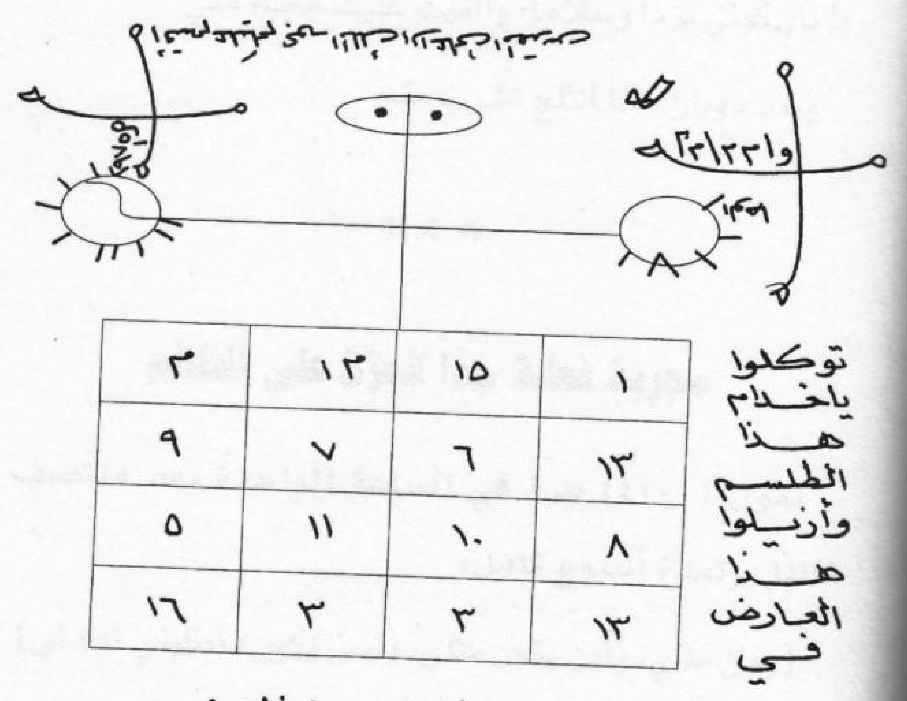

## Halaman PDF 3 (= cetak 9) — LIL-MAWADDAH WAL-MAHABBAH BAINAN-NAAS (agar timbul kecintaan antarmanusia)

Teks mencatat amalan tertulis pada bongkahan es dengan pena tanpa tinta, berisi rangkaian ayat (disalin dan diartikan):

> *Salaamun qaulam mir-robbir-rohiim* — "Salam (sejahtera), firman dari Tuhan Yang Maha Penyayang" (QS. Yaasiin: 58);
> *salaamun 'alaa aali Yaasiin* — "keselamatan atas keluarga Yasin" (dibaca **9 kali**);
> *yaa naaru kuunii bardaw wa salaamaa* — "Wahai api, jadilah yang dingin dan sejahtera" (QS. al-Anbiyaa': 69);
> *wa alqaitu 'alaika mahabbatan minnii* — "Aku melimpahkan kepadamu kasih sayang dari sisi-Ku" (QS. Thaahaa: 39).

**MUJRABAH FA'AALAH JIDDAN LIL-'IZZAH 'ALAZH-ZHAALIM** — amalan "keperkasaan atas orang zalim" (judul babnya dari kitab): ucapan 4.000 kali selepas tengah malam selama sepekan: *"wa mam-mitslii, wa aina yakuunu mitslii, wa laisa yakuunu fa-athlubunii tajidunii"* — "Siapa menyerupai-Ku? Di mana ada yang seperti-Ku? Tidak ada — maka carilah Aku, niscaya engkau mendapati-Ku" (redaksi berita tekstual kitab). **Telaah filologi:** ungkapan "pencarian nama agung Tuhan" ini populer di majmu'ah doa rakyat; di kajian sekadar didokumentasikan.

## Halaman PDF 4 (= cetak 11) — lanjutan "Raf' al-Faqr" + HIJAAB LIL-IINJAAB (azimat untuk keturunan)

**Penutup bab (ambil dari hlm. 10, tercetak di pindaian berikutnya):** sisa amalan raf'ul-faqr: 100 kali saat sujud *"Allaahumma ghayyir suu-a haalii bi-husni haalik"* — "Ya Allah, ubahlah keburukan keadaanku dengan kebaikan keadaan-Mu"; lalu 21 kali *"yaa rohiim"* dan "usap wajah dan badan".

**Pembuka bab baru:** HIJAAB LIL-IINJAAB — suami-istri menulis azimat dengan misik dan za'faran pada hari... (syarat berpuasa, ditulis sebelum berbuka). Isinya rangkaian ayat (disalin dari naskah):

> *Innallaaha laa yukhliful-mii'aad* — "Sungguh Allah tidak menyelisihi janji" (QS. ar-Ra'd: 31);
> *walaw anna qur'aanan suyyirat bihil-jibaalu aw quththi'at bihil-ardhu aw kullima bihil-mautaa, bal lillaahil-amru jamii'aa* — "Andai ada Al-Qur'an yang dengannya gunung-gunung dapat bergerak, bumi terbelah, atau mayat berbicara — bahkan segala urusan itu milik Allah" (QS. ar-Ra'd: 31);
> *was-samaa-i wath-thaariq. Wamaa adraaka math-thaariq. an-najmuts-tsaaqib. in kullu nafsil lammaa 'alaihaa haafizh. falyanzhuril-insaanu mimma khuliq. khuliqa mim-maa-in daafiq. yakhruju mim-bainish-shulbi wat-taroaa-ib* — "Demi langit dan yang datang pada malam hari. Tahukah engkau apakah bintang itu? Bintang yang cemerlang (penembus). Tiadalah satu jiwa melainkan atasnya ada pemelihara. Maka hendaklah manusia memperhatikan dari apa dia diciptakan — diciptakan dari air yang terpancar, yang keluar dari antara tulang sulbi dan tulang dada" (QS. ath-Thaariq: 1–7);
> *fallaahu khairun haafizhoo wa huwa arhamur-roohimiin* — "Allah itu Pemelihara terbaik dan Maha Penyayang di antara para penyayang" (QS. Yuusuf: 64).

Azimat dibawa keduanya empat puluh hari. **Telaah filologi:** pola "hijab = rangkaian ayat pilihan + syarat ritual" adalah corak khas kompilasi mujarrabat.

*(Catatan: pindaian meletakkan cetak 11 sebelum cetak 10 — urutan lembar terbalik; susunan dalam terjemahan ini mengikuti nomor halaman PDF.)*

## Halaman PDF 5 (= cetak 10) — LIL-GHINAA (untuk kekayaan) & LIRAF'IL-FAQR (MUJARRAB)

**LIL-GHINAA:** doa teks naskah:

> *Yaa mu'iidu idzaa barazal-kholaa-iqu min du'aatihi min mukhoofatih, yaa dzal-ma'ruufil-ladzii laa yanqathi'. Allaahumma dillinii 'alaa kariimin ghairik, allaahumma dillinii 'alaa 'azhiimin ghairik, wa kullu syay-in baina yadaik.*
> "Wahai dzat yang mengembalikan (memperbarui) ketika makhluk-makhluk tampil kepada para penyeru-Nya karena takut kepada-Nya; wahai Pemilik kebaikan yang tidak terputus. Ya Allah, tunjukkanlah aku kepada kemurahan (selain)Mu; tunjukkanlah aku kepada keagungan (selain)Mu — segala sesuatu berada di antara kedua tangan-Mu (dalam kekuasaan-Mu)."
> Lalu membaca **Surat Maryam** seluruhnya, pahalanya dihadiahkan kepada Sayyidah Maryam binti 'Imran 'alaihas-salaam.

**LIRAF'IL-FAQR (MUJARRAB):** ucapan 100 kali pukul satu dini hari selama sepekan:

> *Ata'rifu man lahu ismaa ka-asmii? Anar-Rohmaan athlubunii tajidunii.*
> "Tahukah engkau siapa yang memiliki nama seperti nama-Ku? Akulah ar-Rahman — carilah Aku, niscaya engkau mendapati-Ku."
> Lalu sujud dan membaca (bersambung ke cetak 11): *"Allaahumma ghayyir suu-a haalii bi-husni haalik"* (100 kali).

**Telaah filologi:** formula "athlubuni tajiduni" (carilah Aku, kau dapati-Ku) meniru ujaran para sufi tentang nama agung Tuhan (ismil-a'zhom). Dicatat sebagai tradisi lisan, bukan dalil syar'i.

---

# BATCH 2 (Halaman PDF 6–10 = cetak 12, 13, 15, 16, 17) — cetak 14 hilang dari pindaian

## Halaman PDF 6 (= cetak 12) — LIR-RIZQ (rizki) & LIQADHAA-ID-DAIN (melunasi utang)

**LIR-RIZQ:** berita mujarrab dari "hamba yang fakir": malam Kamis sebelum tidur — (1.000) kali shalawat atas Muhammad dan keluarga Muhammad; (1.000) kali *yaa ghoniy*; (1.000) kali *yaa hayyu yaa qoyyuum*.

**LIQADHAA-ID-DAIN:** ucapan 3.000 kali pukul satu dini hari selama sepekan:

> *Anaa malikul-muluuk, wa bikulli mulkin liyal-miiroots, fa-athlubunii tajidunii.*
> "Akulah raja segala raja, dan bagi-Kulah tiap kerajaan menjadi warisan — maka carilah Aku, niscaya engkau mendapati-Ku."

**Telaah filologi:** dua bab ini menampilkan genre "dhikir nama-nama Allah dengan jumlah bilangan" yang lazim dalam buku-buku warig (amalan) rakyat; angka-angka besar ditandai sebagai ciri, bukan ketentuan syari'at.

## Halaman PDF 7 (= cetak 13) — TILSAM LITHARDI UMISH-SHIBYAAN (tilsam menanggalkan "ibunda para bocah" — gangguan jin terhadap anak)

Dicatat oleh naskah: tilsam ditulis waktu maghrib pada 12 potong kain; tiap potong dililitkan ke sebatang lilin dan ujungnya dicelup minyak hewani (naft/minyak hitam); lilin-lilin dinyalakan agar potongan-potongan itu terbakar, dan orangnya diasapi/berada di dekatnya hingga padam; tempatnya **al-hammaam** (kamar mandi/uap). Rajahnya: baris-baris kode huruf dan angka *(kode rajah — banyak yang tidak terbaca jelas)* dan lambang segi empat bercorak. Di bawah, di dalam lambang seperti baju, tertulis tawakkal (salinan gundul):

> *Tawakkaluu yaa khidaama haadzat-thilasm, bi-harqi kulli khadhorin au taabi'atin au shobiyyin... jinniyyatin faa-'iyyah binti faa-'iyyah (nama tidak terbaca jelas). al-'Ajiilo, al-'Ajiilo, al-'Ajiilo. as-Saa'ah, as-Saa'ah, as-Saa'ah. al-Wahhaa, al-Wahhaa, al-Wahhaa.* — "(Wahai khadam tilsam ini — musnahkan oleh pembakaran ini setiap roh hadir, roh pengikut, atau bocah jin ... [nama dalam kode rajah tidak bisa dibaca manuskripnya]: cepatlah, sekarang-juga, segera." *(al-'Ajiil/as-Saa'ah/al-Wahhaa = panggilan ruhani khas untuk "buru-buru/segera."*)*

**Telaah filologi:** "Umu'sh-Shibyaan" adalah jenis kepercayaan rakyat Timur Tengah terhadap roh yang menyakiti anak-anak; ditinjau sebagai bahan budaya (antropologi ruhani), dengan wasiat keselamatan.

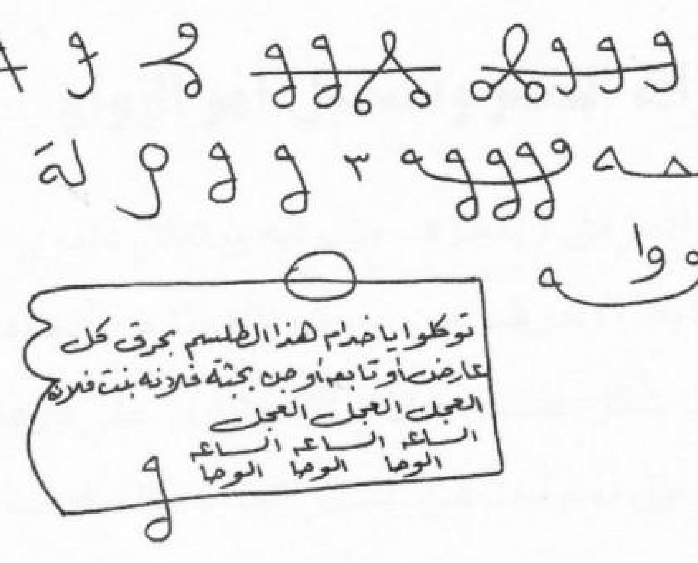

## Halaman PDF 8 (= cetak 15) — LA IBTHAAL AS-SIHR WAL-'AMAL (menangkal sihir dan pekerjaan sihir), kajian

Catatan naskah: tempat dibakhar dengan kemenyan Jawa dan harmal; memakai pakaian bersih-suci; sebelum surat-surat berikut dibaca, membaca:

> *Khorojtu min haulii wa quwwatii ilaa haulika wa quwwatika, wa laa haula wa laa quwwata illaa bik.*
> "Aku keluar dari daya dan kekuatanku menuju daya dan kekuatan-Mu; tiada daya dan tiada kekuatan melainkan dengan-Mu."

Lalu dibaca: Al-Fatihah 110×; surat Yaasin 1×; surat at-Tahriim 1×; surat al-Jinn 1×; dan Aayatul-Kursi 14 kali — diulang (menurut naskah) hingga 21 hari.

**Telaah filologi:** formula "khorojtu min haulii wa quwwatii" adalah ungkapan tasawwuf klasik; sampul surat-surat Al-Qur'an yang dibaca merupakan ruqyah qur'aniyyah murni — jurus pengamanan tidak berbahan rajah.

## Halaman PDF 9 (= cetak 16) — lanjutan + 'ILAAJIL-'AQM (pengobatan mandul) WAN-SIDAAD QANAAWAATIR-ROHIM

**Penutup bab "li-izaalat as-sihr wa tashhiil amril-azwaaj":** lanjutan keterangan "letakkan tulisan pada air bersih-suci — digunakan untuk minum dan membasuh, selama 3 hari".

**'ILAAJIL-'AQM:** resep herbal dari daftar biji (masing-masing 50 g): biji **rosyaad** (kress), **karafs** (seledri), **fijal** (lobak), **bashal** (bawang), **qurofah** (kayu manis), **qoronful** (cengkeh), **habbah sawdaa** (habbatussauda' / jintan hitam) — dicampur bersama, direndam air 4 hari, diminum setengah gelas pagi dan petang, selama 21 hari.

**Telaah filologi:** ini bab pengobatan herbal (*thibb shaunii/tumbuhan*); dari sisi kajian, tumbuhan-tumbuhan itu memang bahan obat tradisional kawasan Syam — namun dosis dan ketepatannya tidak diverifikasi ilmiah, jadi kajian hanya mendokumentasikan tanpa anjuran.

## Halaman PDF 10 (= cetak 17) — HIJAAB LIT-TAA-BI'AH WAL-AHLAAMIL-MUZ'IJAH (azimat untuk roh pengikut dan mimpi-mimpi menakutkan)

Cara kitab mencatat: ditulis dengan za'faran pada kertas saat tengah shalat Jumat di kamar bersih-berbukhur tanpa orang lain, lalu diletakkan di dalam bantal tidur. Isi azimat (salinan dan terjemah inti):

> *Akhastum fiihaa wa laa takallamuu. innii a'uudzu bir-rohmani minka in kunta taqiyyan, au ghaira taqiyyin. akhadztu billaahis-samii'il-bashiir 'alaa sam'ika wa 'alaa bashorika... laa sulthaana laka 'alayya wa laa 'alaa sam'ii wa laa 'alaa bashorii wa laa 'alaa sya'rii wa laa 'alaa basyarii, wa laa 'alaa lahmii wa laa 'alaa damii, wa laa 'alaa makhii wa laa 'alaa 'ishbii, wa laa 'alaa 'izhoomii, wa laa 'alaa maalii, wa laa 'alaa maa rizaqtii. Robbii satarta bainii wa bainaka bi-sitrin-nubuwah, alladzis-tartu an-nabiyyuu-llaahu bihi min salwaatil-jabaabiroti wal-far'auna. Wa Jabroo-iil 'an yamiinii, wa Miikaa-iil 'an yasaarii, wa Isroofiil 'an waroo-ii, wa Muhammadun shollallaahu 'alaihi wa aalih iimaamii — wallaahu muthli'u 'alaiyya bi-mdzi'ik, wa yamna'usy-syaithoon minnii. Allaahumma laa yaghlibu jahluhu anotaka an tastahfazhanii wa tastakhfijanii — Allaahumma ilaikal-tajaat, allaahumma ilaikal-tajaat, allaahumma ilaikal-tajaat harosaka... yaa fulaanu-ibnu fulaanah, shollallaahu 'alaa muhammadin wa aalih.*
> "Kamu-kamu telah menyelundup ke dalamnya (benda itu) — jangan berkata. Sungguh aku berlindung kepada Yang Maha Penyayang darimu, bila engkau bertakwa (jangan ganggu) atau tidak bertakwa: aku berpegang pada Allah Yang Maha Mendengar lagi Maha Melihat (pelindung) pendengaranmu dan penglihatanmu... Tidak ada kekuasaan bagimu atasku — tidak atas pendengaranku, penglihatanku, rambutku, kulitku, dagingku, darahku, otakku, uratku, tulangku, hartaku, maupun rizkiku. Tuhanku telah membentang tabir Nubuwwah antara aku dan engkau, tabir yang dipakai para nabi melindungi diri dari para raja zalim dan Fir'aun. Jibril di kananku, Mikail di kiriku, Israfil di belakangku, dan Muhammad shollallaahu 'alaihi wa aalih di hadapanku; Allah mengawasiku karena kuat-Mu dan menghalau setan dariku. Ya Allah, kebodohan manusia tak membuat-Mu menyerah untuk melindungi dan menyelamatkanku. Ya Allah, kepada-Mu aku menyandarkan diri (3×) — ya Fulan bin Fulanah... (ditutup shalawat)."

*(bersambung ke halaman berikutnya dengan lanjutan shalawat dan Ayat Kursi.)*

**Telaah filologi:** azimat ini berbentuk doa perlindungan khas Syiria (dengan sebutan malaikat empat penjuru) — dari sudut kajian ia adalah doa umum, tidak mengandung rajah berbahaya.

---

# BATCH 3 (Halaman PDF 11–15 = cetak 18, 19, 20, 22, 21) — cetak 22 & 21 tertukar urutannya dalam pindaian

## Halaman PDF 11 (= cetak 18) — penutup HIJAAB LIT-TAABI'AH + pembuka SHOLAWAAT LIQADHAA-IL-HAAJAAT

**Penutup bab (ambil dari sambungan hlm. 17):** doa ditutup dengan:

> *'alaa muhammadin wa aalih — ALIM. allaahu laa ilaaha illaa huwal-hayyul-qoyyuum;　laa ta'khudzuhuu sinatun wa laa naum;　lahu maa fis-samaawaati wa maa fil-ardh... waw ma'a tath-thuuwau ... sadza-l-ladzii yasfa'u 'indahuu illaa bi-idznih. ya'lamu maa baina aidiihim wa maa khalfahum, wa laa yuhiithuuna bi-syay-in min 'ilmihii illaa bi-maa syaa-aa. wasi'a kursiyyuhus-samaawaati wal-ardh, wa laa yuuduhuu hifzhuhumaa, wa huwal-'aliyyul-'azhiim* — **Ayat Kursi** seluruhnya;
> lalu *laa haula wa laa quwwata illaa billaah;　laa malja-a minallaahi illaa ilaihi;　hasbiyallaahu wa ni'mal-wakiil;　wa uslimtu ilaa ro'sisy-syuhada (ilaa makbaril-muqaddas tarsal)?　—　washollallaahu 'alaa muhammadin wa ahlibaitihith-thoohiirin, wa sallama tasliiman katsoiron;　walhamdu lillaahi robbil-'aalamiin;　wash-sholaatu wasn't-salaamu 'alaa muhammadin wa aalihith-thoohiriin*.
> "Tiada daya selain dengan Allah; tiada tempat berlindung dari Allah melainkan kembali kepada Allah; cukuplah Allah bagiku, sebaik-baik penolong; dan aku pasrahkan... Shalawat dan salam atas Muhammad dan keluarganya yang suci secara berlimpah."

**Pembuka bab SHOLAWAAT LIQADHAA-IL-HAAJAAT (shalawat-shalawat untuk memenuhi hajat):** dibaca rangkaian shalawat, ragam pertamat:

> *Allaahumma sholli 'alaa muhammadin wa aali muhammad bi-'adadi qathroothil-mathor* (1.000 kali) — "Ya Allah, limpahkanlah shalawat atas Muhammad dan keluarga Muhammad sebanyak tetes hujan."

## Halaman PDF 12 (= cetak 19) — penutup SHOLAWAAT + pembuka BUKHUUR LIMAN'AS-SIHR

Lanjutan ragam shalawat (masing-masing 1.000 kali):

> *bi-'adadi maa bainas-samaa-i wal-ardh* — "sebanyak (ruang) antara langit dan bumi";
> *bi-'adadan-nujuum maa baraza wa mandatsar* — "sebanyak bintang yang tampak dan yang tersembunyi";
> *bi-'adadi waroflotisy-syajar* — "sebanyak lembaran daun pepohonan";
> *bi-'adadi qathroothin-nadaa* — "sebanyak tetesan embun."

**BUKHUUR LIMAN'AS-SIHR WAL-'AARIDH (dupa penghalau sihir dan 'aridh):** bahan yang tercatat, tiap 100 gram: **as-sarab** (kemenyan arab/incense), **syajaroh maryam** (pohon "Maryem"/resin khusus), **harmal** (biji harmal), dan **khardal** (biji sawi) ...

## Halaman PDF 13 (= cetak 20) — lanjutan dupa + 'ILAAJIL-QOULUUN (pengobatan asma) — kajian

Sisa bahan dupa: **jaawi** (kemenyan Jawa) 100 g, **za'faraan** 100 g, **badzar khorruub** (biji karob) 100 g, **libaan dzakar** (kemenyan jantan) 100 g, **sandaruus** (getah damar cemara) 100 g. Cara naskah: bahan ditumbuk, diuleni cuka, dibentuk bola-bola, dikeringkan di tempat gelap; digunakan membakar dupa 21 hari, pagi dan petang.

**'ILAAJIL-QOULUUN (asma):** tempat si sakit dibersihkan dan disucikan; oleh orang lain, dibacakan ke dekat kepalanya saat ia tertidur, sebelum terbenam matahari:

> *Khorojtu min haulii wa quwwatii ilaa haulika wa quwwatika, wa laa haula wa laa quwwata illaa billaah.*
> Lalu dibacakan: **surat Yaasiin 3 kali dan Al-Fatihah 110 kali**.

**Telaah filologi:** "al-qoulun" adalah asma yang dipercaya turun karena pengaruh ruhani; amalan ini murni pembacaan ayat — ruqyah qur'aniyyah tanpa rajah.

## Halaman PDF 14 (= cetak 22) — THILASM LIL-HUBB WAL-'ASYQ (tilsam rasa cinta) — bahan kajian filologi saja

Catatan naskah: tilsam ditulis dengan za'faran pada kertas, ditaruh dalam bekas (dibungkus), dijahit rapat lalu ditimbun di tempat yang "tidak sampai ke sana manusia atau hewan". Rajahnya berupa **kotak tiga baris huruf kode rajah** (huruf-huruf terputus dan angka 111, 848?, 911 di sisi-sisinya) dengan teks kode di bawahnya — huruf-hurufnya *(kode rajah — sebagian besar tidak bisa dibaca)*: "ع م ١ … ط ٥ لـــه البلاد جمع / به ه و ١١ هيج دور حرار / هيصراجع … احرك ادك حرك ادك اول كوناي سواها". Di bawahnya kalimat tawakkal diulang 7 kali (dalam transkripsi):

> *Yaa khudoama haadzihil-asmaa, ihriquu qolba fulaan ibni fulaanah, bi-hubbi fulaanatin binti fulaanah.*
> "Wahai para khadam nama-nama ini, panaslah hati si Fulan bin Fulanah dengan cinta Fulanah binti Fulanah."

**Telaah filologi — penting:** bab ini termasuk kategori "fikriyat/cinta" — pengarahan gaib terhadap perasaan orang tertentu. Dalam kajian ini hanya didokumentasikan nama dan struktur teksnya lalu diserahkan pada wasiat: *laa tasta'miluuhu illaa fii maa yurdhillaah* — perilaku yang mengarah paksaan/merugikan orang lain termasuk **dhoror yang tidak boleh diamalkan** dan teksnya di kajian ini tidak disertai cara penggunaan.

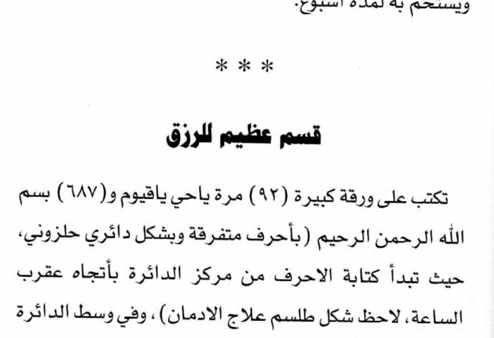

## Halaman PDF 15 (= cetak 21) — penutup 'ILAAJIL-QOULUUN + pembuka QASAM 'AZHIIM LIR-RIZQ (sumpah agung untuk rizki)

**Penutup bab asma:** ambil **garam kasar (malhun khoselyun)** yang dibacakan: surat ar-Rahman 3 kali; surat Yaasiin 1 kali; al-Mu'awwidzatain (al-Falaq dan an-Naas) masing-masing 7 kali; garam itu dilarutkan dalam air dan dipakai mandi selama sepekan (menurut naskah).

**QASAM 'AZHIIM LIR-RIZQ:** pada lembar besar ditulis *"yaa hayyu yaa qoyyuum"* **92 kali** dan **basamalah 687 (—angka abjad; yang masyhur di kalangan penulis rajah adalah 786, kemungkinan ini salah cetak)** kali — semuanya **huruf per huruf, tersusun melingkar spiral (daairiy halzuuniy)** dimulai dari pusat melawan arah jarum jam; di pusat lingkaran ditulis:

> *Allaahumma aqsamtu 'alaika bin-nuqthatayni ('alā?) — bil-nuqthotilatiy tahtal-baa-i wa bin-nuqthotil-latiy tahtal-yaa-i, an tafukka kulla qofli-liroqii anaa fulaanu-ibnu fulaanah, wa qod aqsamtu 'alaika bi-qoosamin 'azhiim.*
> "Ya Allah, aku bersumpah demi-Mu, demi titik di bawah huruf ba' dan titik di bawah huruf ya', agar Engkau membukakan setiap kunci rizkiku, aku Fulan bin Fulanah — sungguh aku telah bersumpah demi-Mu dengan sumpah yang agung."

**Telaah filologi:** "qasam 'azhiim" (sumpah besar) adalah ungkapan ruhani dalam tradisi de'ama' (doa khoss); titiknya ba-ya merujuk pada **بسم الله الرحمن الرحيم** yang dimulai ba dan diakhiri huruf ya ("...الرحيم") — simbolisme abjad khas kitab mujarrabat.

---

# BATCH 4 (Halaman PDF 16–20 = cetak 24, 23, 25, 26, 27) — cetak 24 & 23 tertukar urutannya dalam pindaian

## Halaman PDF 16 (= cetak 24) — LIQADHAA-IL-HAAJAH WAT-TAGH-YIIR MIN HAAL ILAA HAAL (mengabulkan hajat & mengubah keadaan)

Doa-doa naskah (tiap 1.000 kali):

> *Allaahumma as-aluka bismikal-ladzii yughoyyirul-asyi-yaa'* — "Ya Allah, aku meminta demi nama-Mu yang mengubah segala sesuatu.";
> *allaahumma as-aluka biqudratikal-latii tughoyyirul-asyi-yaa'* — "... demi kudrat-Mu yang mengubah segala sesuatu.";
> *allaahumma as-aluka bismikal-ladzii taquulu bihi lill-asyi-yaa-i "kun" fa-yakuun — an tughoyyira suu-a haalii bi-husni haalik* — "... demi nama-Mu yang bila Engkau berfirman kepada segala sesuatu: 'Jadilah', maka jadilah ia — agar Engkau mengubah keburukan keadaanku dengan kebaikan keadaan-Mu."

## Halaman PDF 17 (= cetak 23) — LIZZAWAAJ (pernikahan) & DLO'FIL-MASYI 'INDAL-ATHFAAL

**LIZZAWAAJ:** menurut naskah dilakukan hari Jumat sejam sebelum adzan zhuhur: mandi; shalat dua rakaat; membaca surat Thaahaa 3 kali; lalu ucapan:

> *Yaa waliyya kulli dlo'iif — iilaahii qod a'taituka wa lam ajid adlo'afa minnii — iilaahii qowwinii.*
> "Wahai pelindung tiap orang lemah. Tuhanku, sungguh aku mendatangi-Mu dan tidak mendapati orang yang lebih lemah dariku. Tuhanku, kuatkanlah aku."

**LIMU'AALAJAH DLO'FIL-MASYI 'INDAL-ATHFAAL** (kelemahan belajar berjalan pada anak): surat al-Hasyr ditulis dengan za'faran pada kertas, diletakkan dalam minyak zaitun; tubuh (anak) diusap dengannya 10 hari berturut-turut (dicatat kajian).

**LIR-RIZQ MUJARRAB:** pada pukul 1 dini hari dibaca: *al-hayyul-qoyyuum* 1.070 kali; *yaa rohiim* 7 kali; dan surat Yaasiin 1 kali.

## Halaman PDF 18 (= cetak 25) — 'ILAAJUT-TA'AB (kelelahan) & LIS-SYIFAA MINAL-AMROODH

**'ILAAJUT-TA'AB:** pada garam kasar dibacakan surat Yaasiin, al-Waaqi'ah, dan ar-Rahman; lalu dibaca 72 kali ayat:

> *Yaa ma'syarol-jinni wal-insi, inistatho'tum an tanfudzuu min aqthooris-samaawaati wal-ardhi fanfudzuu — laa tanfudzuuna illaa bisulthoon.*
> "Wahai golongan jin dan manusia — jika kamu sanggup menembus penjuru langit dan bumi, tembuslah; kamu tidak akan dapat menembusnya melainkan dengan kekuatan (dari Allah)" (QS. ar-Rahman: 33).

Garam dilarutkan dalam air, dipakai mandi hari Rabu tengah hari (ba'daz-zawaal) dan ditaburkan di ambang pintu (kajian).

**LIS-SYIFAA MINAL-AMROODH:** pada garam dibacakan surat Yaasiin, ar-Rahman, dan al-Jinn; dilarutkan dan dipakai mandi 3 hari berturut: Rabu, Kamis, Jumat (versi lengkap ada rahmat rizq? — naskah: "wa ... bihi" dicatat).

**Telaah filologi:** kedua "resep" di atas adalah _ruqyah binal-milh_ (pembacaan ayat pada garam) — dikenal luas sebagai praktik rakyat; kajian mencatatkan struktur formula tanpa menjamin mujarrab.

## Halaman PDF 19 (= cetak 26) — THILASM LIL-MAHABBAH (tilsam kasih sayang)

Dicatat naskah: ditulis pada potongan kain di hari Sabtu; di dalamnya diletakkan "debu bekas telapak orang yang dikasihi" (turoob min atsaril-mahbuub), dilipat, disimpan di dalam rumah, di tempat yang "tidak dikenal" (tersembunyi). Rajahnya: gambar bingkai dengan huruf-huruf kode rajah di segenap sudutnya; di tengahnya — ayat terpata:

> *Wa alqoitu 'alaika mahabbatan minnii ... (li-tushna'a 'alaa 'ainii)* — "... dan Kucurahkan kepadamu kasih sayang dari sisi-Ku (supaya kamu dibesarkan dalam pengawasan-Ku)." (QS. Thaahaa: 39)

Di bawahnya kalimat doa:

> *Yaa waduud — as-aluka an taj'alal-wadda wal-majda (dengan kemesraan) fii qolbi fulaan ibni fulaanah 'alaa fulaanah binti fulaanah.*
> "Wahai (Allah) Yang Mahakasih — aku minta Kau letakkan kerinduan dan kemesraan di hati Fulan bin Fulanah terhadap Fulanah binti Fulanah."

**Telaah filologi:** sama dengan bab **hubb** pada cetak 22 — termasuk kategori fikriyat (merebut perasaan); kajian sekadar mendokumentasikan bentuknya, tanpa cara pemakaian, sejalan wasiat "tidak dipakai selain pada yang diridhai Allah".

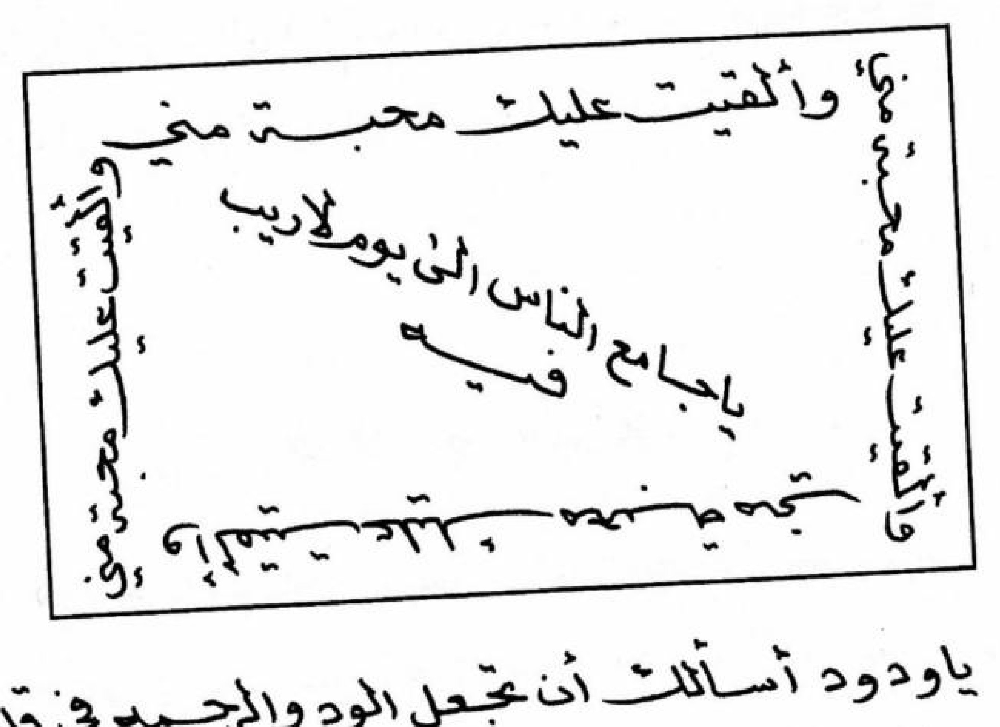

## Halaman PDF 20 (= cetak 27) — LIL-HUSHUUL 'ALAL-'AMAL WA QADHAA-IL-HAAJAH + LIS-SYIFAA MINAL-AMROODH (varian air zamzam)

**LIL-HUSHUUL 'ALAL-'AMAL** (memperoleh pekerjaan): Jumat sebelum terbenam matahari, di atas atap rumah, dibaca 1.000 kali *"yaa mujiib yaa sarii'"* — "wahai Yang Maha mengabulkan, wahai Yang Maha cepat"; lalu *"allaahumma ajib tholabii"* — "Ya Allah, kabulkanlah permintaanku"; ditutup dengan sujud sambil membaca 1.000 kali *"bi-'izzatika wa jalaalika ajib su-aalii"* — "demi keperkasaan dan keagungan-Mu, kabulkanlah permintaanku".

**LIS-SYIFAA MINAL-AMROODH (air zamzam):** dibacakan pada air zamzam 6 hari berturut: hari pertama Al-Fatihah 300 kali; hari kedua Al-Ikhlas 1.000 kali; hari ketiga shalawat 1 kali dan Ayat Kursi 14 kali; hari keempat surat Yaasiin dan Thaahaa; hari kelima surat Alam Nasyrah — *(lanjutan hari keenam di halaman berikutnya).*

---

# BATCH 5 (Halaman PDF 21–25 = cetak 29, 28, 30, 31, 32) — cetak 29 & 28 tertukar dalam pindaian

## Halaman PDF 21 (= cetak 29) — penutup resep dupa + LIR-RIZQ (asma Agung)

**Penutup (sambungan bahan dupa dari hlm. 28):** ... **sandaruus** (getah damar) 50 g — semua bahan diuleni air mawar, dikeringkan di tempat gelap, lalu dipakai membakar dupa pagi dan petang selama sepekan penuh.

**LIR-RIZQ:** ditulis pada kertas yang putih "asmau rasulil-a'zhom shollallaahu 'alaihi wa aalih" — menurut naskah nama rahasia Rasul itu adalah: **al-Ghofuuru, ar-Rohiimu, al-Yatiimu(—dalam naskah demikian; kemungkinan salah cetak—), ash-Shobuuru, asy-Syakuuru**; lalu ditulis doa:

> *Yaa allaah, yaa allaah, yaa alloh; yaa robb, yaa robb, yaa robb; yaa hayy yaa qoyyuum; yaa hayy yaa qoyyuum yaa dzal-jalaali wal-ikroom; yaa dzal-jalaali wal-ikroom. Allaahumma as-aluka bismikal-a'zhom an tarzuqnii rizqon halaalan thoyyiban bi-rohmatika laa yanbadzu abadan.*
> "Ya Allah (3×), ya Rabbi (3×), Wahai Yang Hidup lagi Yang Maha berdiri (2×), wahai Pemilik keagungan dan kemuliaan (2×). Ya Allah, aku meminta demi nama agung-Mu, agar Engkau memberiku rizki yang halal lagi baik, dengan rahmat-Mu, yang tak pernah habis selamanya."

Doa ini ditulis (menurut naskah) tiga kali dan diletakkan di rumah atau tempat usaha.

## Halaman PDF 22 (= cetak 28) — penutup LIS-SYIFAA MINAL-AMROODH (zamzam) + BUKHUUR LIMAN'IL-MASSA MINAL-JINN

**Penutup bab zamzam:** hari keenam al-Mu'awwidzatain (al-Falaq dan an-Naas) masing-masing 9 kali; tiap hari air dibacakan dalam keadaan tertutup; setelah tuntas, air dibagi dua: separuh untuk diminum, separuh untuk membasuh — selama sepekan.

**BUKHUUR LIMAN'IL-MASSA MINAL-JINNI WASY-SYAITHOON** (bahan dupa penangkal "sentuhan" jin-setan): tiap 50 g — **harmal**, **khorruub** (karob), **jaawi** (kemenyan jawa), **libaan dzakar** (kemenyan jantan), **may'atun saa-ilah** (sejenis damar cair), **za'faraan** (safron) … *(lanjutannya: sandaruus 50 g — disebut di atas halaman 29 sesuai susun teks pindaian yang terbalik).*

## Halaman PDF 23 (= cetak 30) — THILASM LITHARDIT-TAA-BI'AH MUJARRAB WA QOWIYY (tilsam menanggalkan roh pengikut — versi ampuh menurut klaim naskah)

Catatan naskah identik dengan bab sebelumnya (hlm. 13): ditulis pada 12 potong kain waktu maghrib; tiap potong dililitkan ke sebatang lilin yang ujungnya dicelup naft (minyak hitam); dibakar dan tempat'nya hammaam. **Rajahnya** adalah lingkaran saroni besar penuh huruf-huruf kode dengan lambang-lambang pemutaran *(kode rajah — hampir seluruhnya tidak bisa dibaca; hanya fragmen angka ٤٩٩٢... dst. dan kata terputus terlihat)*. Pada salinan tangan ini terdapat catatan pembaca kitab di pinggir tulisan: **"wal-hadzar"** — tanda "hati-hati/waspada" yang ditambahkan kemudian — bukti bahwa bab seperti ini dianggap seram pula oleh pemilik naskahnya.

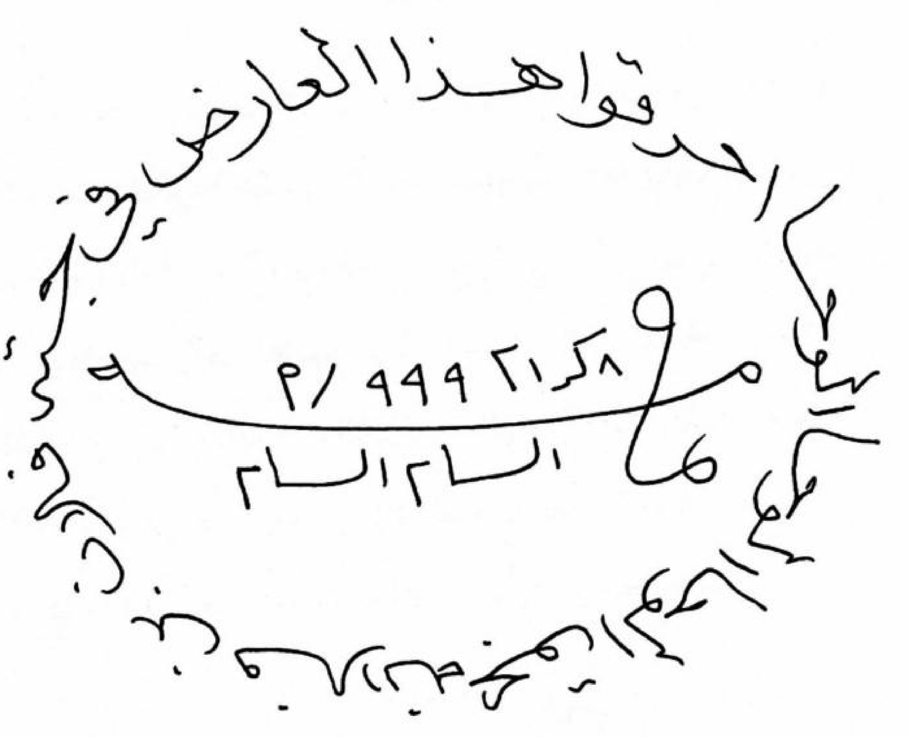

## Halaman PDF 24 (= cetak 31) — 'ILAAJU WAJA'IR-RO'S & 'ILAAJU AUJAA'IL-ARJIL (pengobatan herbal: sakit kepala & kaki)

**Sakit kepala:** campuran cengkeh 50 g, habbatus-sawdaa' (jintan hitam) 50 g, kayu manis 50 g — dicampur bersama dengan air; diminum 1 sendok teh saat perut kosong selama 7 hari (dicatat kajian).

**Nyeri kaki:** **handzhal** (henzala — tanaman pahit), **harmal**, garam, dan cuka direbus dalam periuk hingga menjadi hangat; setelah hangat, kaki direndam di dalamnya (dibuatkan kompres/rendaman hangat) selama beberapa hari secara berulang.

**Telaah filologi:** keduanya resep rumahtangga tradisional; obat-obat tersebut amat keras (handzhal sangat pahit dan beracun dosis tinggi) — penelitian hanya mendokumentasikan, tanpa anjuran penggunaan.

## Halaman PDF 25 (= cetak 32) — LA IBTHAAL AS-SIHR WA IZAALATUH + KHAATIM LITHARDIL-'AARIDH WAS-SIHR WAL-HAWAA

**LA IBTHAAL AS-SIHR (doa):**

> *Ilaahii khorojtu min haulii wa quwwatii ilaa haulika wa quwwatika, wa laa haula wa laa quwwata illaa billaah. Allaahumma-ij'al lii fii kulli kalimatin atluuhaa rohmatan wa syifaa-a birohmatika yaa arhamar-roohimiin.*
> "Tuhanku, aku keluar dari dayaku menuju daya-Mu... Ya Allah, jadikanlah pada setiap kalimat yang kubaca rahmat dan kesembuhan dengan rahmat-Mu, wahai Yang Terkasih di antara para pengasih."

Lalu (menurut naskah) dibaca surat Yaasiin, dan tiap kali sampai pada kata **مبين** (mubiin) dalam suratnya, diucapkan:

> *Yaa man adzallas-saharota bi-'ajaaza Muusaa — allaahumma azlil-sihra min fulaan ibni fulaanah, bismikal-aa'jil ('a'zhomil)-aa'zil-aa'jiz... allaahummaj'alil-haqqo haqqon wa azhiqil-boothil.*
> "Wahai yang menghinakan para penyihir dengan mukjizat Musa — Ya Allah, gugurkanlah sihir dari Fulan bin Fulanah, demi nama agung-Mu yang perkasa; Ya Allah, nyatakanlah yang haq sebagai haq dan hancurkanlah yang batil." (dijalankan sepekan, tiap hari.)

**KHAATIM LITHARDIL-'AARIDH WAS-SIHR WAL-HAWAA** — khatam/segel yang diklaim kuat-teruji untuk jasmani: ditulis di kertas; bagian isi yang tercetak terbaca hanya pembuka lalu kode rajah *(tidak terbaca jelas)*:

> *Ihriquul-'aaridha fii jismi fulaan ibni fulaanah, wa abthiluu kulla sihri... tholmaa-sa-'un (٣٣)?? — ahha (٥)?? — salmawiyyah nahbiirah?? (kode rajah — tidak terbaca jelas)*
> "Bakar/hanguskanlah gangguan (ilmu) dalam tubuh Fulan bin Fulanah, dan binasakanlah tiap sihir..."

**Telaah filologi:** bab ini menampilkan peralihan dari doa murni (penawar sihir bertema mukjizat Musa) ke bentuk khatam kode-khoss; riwayat kode-khoss (dikaiu "khotim sayyidi") di kajian direkam apa adanya dari naskah, tanpa tafsir teknis yang dapat dipakai.

---

# BATCH 6 (Halaman PDF 26–30 = cetak 33, 34, 35, 38, 39) — cetak 36–37 hilang dari pindaian

## Halaman PDF 26 (= cetak 33) — penutup KHAATIM LITHARDIL-'AARIDH + MUSHALAJATUL-'AQM (obat mandul, varian resep bandel)

**Penutup khatam (sambungan dari cetak 32):** dalam lembar khatam ditulis lanjut:

> *... nahbiroh hakkuu (٢) — ajib, yaa mit-thothoruun (nama terputus karena dicoret pada salinan ini) bihaqqi haadzihil-asmaa-i — wahjub wa abthil kulla sihri wa 'aaridhin, wa kulla riihin, wa kulla suu-in 'amman tubakhkhoru bihaadzihil-asmaa-i — al-Wahhaa (٢), al-'Ajalu (٢), as-Saa'ah (٢).*
> "... demi nama-nama ini: kaburkanlah dan batalkanlah tiap sihir, tiap 'aridh(gangguan), tiap penyakit/angin jahat dan tiap keburukan bagi siapa yang diasapi dengan nama-nama ini — secepatnya, kini juga, saat ini juga."

Catatan filologi: terdapat **coretan pada satu kata** di salinan ini (sebuah nama khoss sengaja dicoret oleh pemilik/pembaca kitab) — tanda budaya menjaga nama-nama rajah. Kertas itu lalu dibakar sambil dibakhar kemenyan jaawi; diulang 3 kali sehari (pagi, tengah hari, sore) selama sepekan, menurut naskah.

**MUSHALAJATUL-'AQM (varian):** biji-bijian yang digiling bersama: rosyaad 100 g, karafs (seledri) 100 g, bawang 100 g, cengkeh 50 g, harmal 20 g — diminum 3 sendok kecil tiap hari (pagi, siang, malam) selama 10 hari, didahului segelas jus lobak saat perut kosong, dan sejam kemudian segelas jus seledri.

## Halaman PDF 27 (= cetak 34) — THILASM LI-'ADAMIN-NAUM 'INDAL-ATHFAAL (tilsam untuk anak yang sulit tidur)

Catatan naskah: tilsam ditulis pada kain dan dibakhar dengan harmal. **Rajahnya** lingkaran berisi huruf-huruf kode dan di tengah tercetak beberapa inskripsi yang terbaca sebagian *(kode rajah)*: angka **٨٨٥٣** dan deretan vav, dan satu frasa yang terbaca jelas di lingkar tengah:

> *"... syaythaanuhuu fii naaril-jahiim — (nama anaknya)"* — "setannya (yang mengganggu) berada di dalam api Jahannam — (nama anaknya)".

**Telaah filologi:** formula "setannya ke neraka" adalah ciri rajah penenang bayi Arab klasik (Umu'sh-Shibyaan complex); dari sudut kajian rajah ini didokumentasikan tanpa cara pemakaiannya.

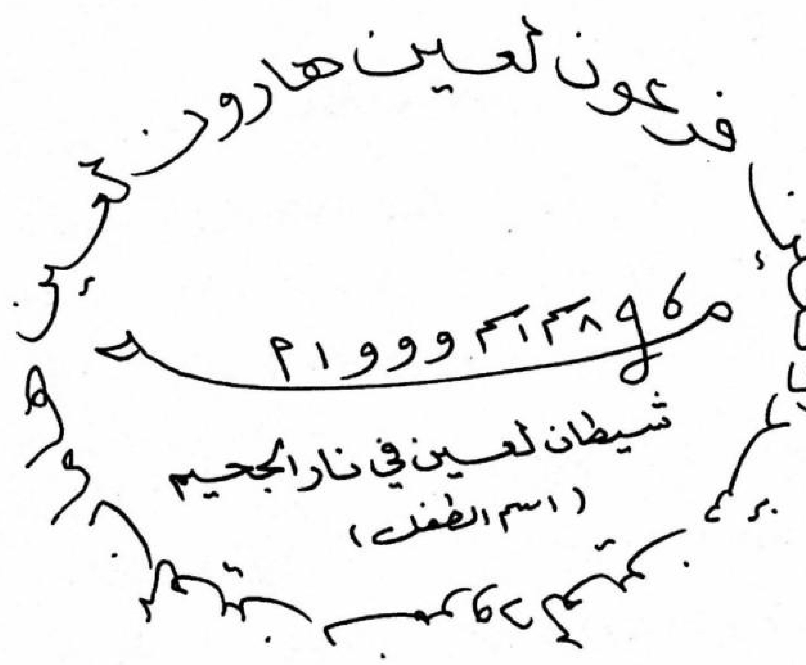

## Halaman PDF 28 (= cetak 35) — CIRI-CIRI KELUWAS (l'ilaaji katsrotin-naum) & 'ILAAJI DHIIQIN-NAFAS + pembuka 'ILAAJ LIL-IDMAAN

**Kedalu banyak tidur:** jus seledri ditambah zat besi (dari apotek), dijadikan sirup (syaarbuun) selama 4 hari.

**Sesak nafas (dhyiiq an-nafas):** adas manis 250 g dan beras 250 g dicampur susu dan minyak (zaitun), direbus dalam periuk — kemudian si sakit dan periuknya ditutup selimut supaya si sakit mengemutan uapnya (seperti sauna uap), 3 hari berturut (kajian).

**'ILAAJ LIL-IDMAAN (kecanduan):** dibaca kalimat *"shiroothom-mustaqiim"* (jalan yang lurus) — yaitu ayat pembuka Al-Fatihah bagian terakhir — sebanyak **313 kali** pada air, dan orang yang kecanduan minum dari air tersebut (dicatat kajian).

**Telaah filologi:** 313 merujuk jumlah pasukan Badar — simbolisme angka khas; dari segi kajian, pembacaan ayat pada air adalah ruqyah air yang umum.

## Halaman PDF 29 (= cetak 38) — LA IB'AAD ASY-SYARR WAL-HASAD WAN-NAFAS MINAL-MANZIL + LIMAN-I TASAAQUTH ASY-SYA'R (rambut rontok)

**Menghambat keburukan/i-dengki dari rumah:** pada harmal dibacakan surat Yaasiin, al-'Aadiyaat, Thaahaa, dan al-Mu'awwidzatain; lalu diucap:

> *Allaahumma as-aluka bikulli mulkin ilaa wa thordatusy-syarri min haadzal-bait, kamaa yatharodud-dzi'bas-syaat — al-'ajalu, al-'ajalu, as-saa'atu, as-saa'atu — baarokallaahu fiikum.*
> "Ya Allah, aku meminta demi (nama-Mu) ... kami usir keburukan dari rumah ini sebagaimana serigala mengusir kambing — segera, segera; kini, kini. Semoga Allah memberkati kalian."

Lalu rumah dibakhar dengan harmal (penutup kajian).

**Kerontokan rambut (tasaquth asy-sya'r):** campuran minyak almond pahit 100 g, minyak zaitun 125 g, dan minyak sawi (khordal) 50 g — dicampur dan dioleskan ke wilayah rambut yang rontok di kepala, alis, atau kumis, dari waktu maghrib sampai fajar, selama 21 hari (herbal).

## Halaman PDF 30 (= cetak 39) — THILASM L'ILAAJIL-IDMAAN (tilsam untuk kecanduan: narkoba, khomar, zina dan rokok)

Catatan naskah: tilsam ditulis pada kain dari pakaian si pecandu, dimasukkan ke dalam batang **bambu/tebu kering** (*qoshobatin min nabaatil-qoshob*), dan dicatat "ditimbun di kubur" (wa tudfanahu fii qobrin) — frasa ini menegaskan bahasan **rajah ini termasuk praktik yang tidak boleh dijalankan** (kaitan pada kubur/keburukan) — satu lagi bukti bahwa buku ini memuat campuran bahan dan wasiatnya adalah dipakai "hanya pada yang diridhai Tuhan". **Rajahnya** adalah lingkaran besar berbentuk spiral halzuuniy: huruf-per-huruf melingkar dari luar ke dalam (teks cara bacaannya tidak terbaca seperti tulisan biasa): pada pusat dan lintasan spiralnya terbaca sisa-sisa huruf seperti *"٧ ح و د ب ح و د"* dan *"ز م ث ي س ن"*, serta sisa lambang, angka, dan pengulangan jejak ayat *"shiroothom-mustaqiim"* yang tampak disalin terpisah sepatah-sepatah — keseluruhannya tidak bisa dibaca seperti bacaan biasa (kode rajah).

**Telaah filologi:** bentuknya menunjukkan contoh khas tilsam *halzuuniy mutakarrir* (spiral huruf berulang) — nilai kajiannya adalah dokumentasi bentuk huruf rajah itu sendiri, bukan artinya.

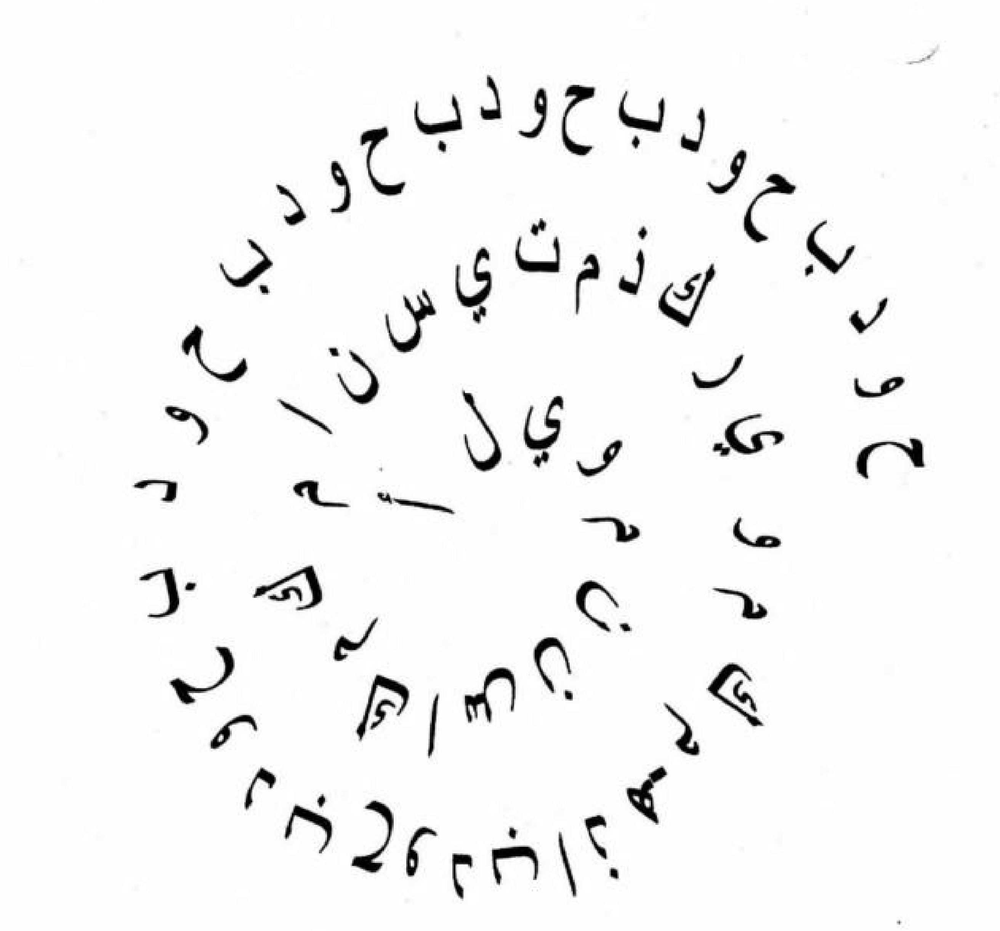

---

# BATCH 7 (Halaman PDF 31–35 = cetak 41, 42, 43, 44, 45) — cetak 40 hilang dari pindaian

## Halaman PDF 31 (= cetak 41) — LIRUJUU-IL-GHO-IB (kembalinya orang yang hilang/bepergian) & LIL-HUSHUUL 'ALAA FURSHOTIL-'AMAL

**LIRUJUU-IL-GHO-IB:** catatan naskah: dengan pakaian bersih, di tempat yang dibakhar kemenyan jaawi, dibaca: **Qul huwallaahu ahad (surat al-Ikhlas) 1.000 kali**; lalu ayat:

> *Aynamaa takuunuu yudrikukumul-maut* — "Di mana saja kamu berada, kematian akan mendapatkanmu" (QS. an-Nisaa': 4) — setelahnya setiap waktu membaca **surat Thaahaa (206?)**; setelah lima menit dibaca surat Thaahaa; kemudian sujud dan mengucapkan 1.000 kali:
> *Allaahumma ilaikal-tajaat* — "Ya Allah, kepada-Mulah aku berlindung."

Naskah mencatat dikerjakan pukul 12 tengah malam selama 15 hari. **Telaah filologi:** "kembali orang yang hilang" adalah corak cinta/keluarga (gho-ib = kerabat bepergian) — amalannya murni bacaan Al-Qur'an dan hajat doa, bukan rajah.

**LIL-HUSHUUL 'ALAA FURSHOTIL-'AMAL** (memperoleh kesempatan kerja): ucapan 1.000 kali:

> *Ata'rofu man lahu ismaa ka-asmii? Anar-Rohmaan — athlubunii tajidunii.*
> "Kenalkah engkau dzat yang memiliki nama seperti nama-Ku? Akulah ar-Rahman — carilah Aku, kau dapati-Ku."

Lalu tangan diletakkan di mulut sambil membaca **ar-Rahman 21 kali**, diusapkan ke wajah; kemudian sujud. (Kajian; tidak ada rajah.)

## Halaman PDF 32 (= cetak 42) — 'ILAAJUL-MARODH (penyakit, umum) + pembuka 'ILAAJ LI-DAA-ITS-TSA'LAB

**'ILAAJUL-MARODH:** dibacakan pada air zamzam atau air hujan yang ditampung langsung dari langit: Al-Fatihah 300 kali; surat Yaasiin 1 kali; shalawat atas Nabi 100 kali; al-Mu'awwidzatain masing-masing 70 kali; surat at-Tauhiid (al-Ikhlas) 70 kali; Aayatul-Kursi 14 kali — airnya diminum (menurut naskah) 10 hari.

**'ILAAJ LI-DAA-ITS-TSA'LAB** ("penyakit rubah" — gangguan rambang kepala/kerontokan rambut yang dipercaya dari ulat buruk, menurut istilah rakyatnya): daun **sidr** dan **yuus/yaasawar?(al-yuus = biji eranga?)** dihaluskan dengan kapur (**kaafur**), lalu dibacakan padanya surat Yaasiin 1×, surat Thaahaa 1×, dan al-Mu'awwidzatain masing-masing *(lanjutan di halaman berikutnya)*.

*(Catatan kajian: "daa-its-tsa'lab" (penyakit rubah) adalah nama rakyat untuk sejenis gangguan kesehatan kulit rambut; sebutan ini dicatat sebagai isi naskah tanpa kesimpulan klinis.)*

## Halaman PDF 33 (= cetak 43) — penutup DAA-ITS-TSA'LAB + 'ILAAJUL-HASAD + 'ILAAJI AUJAA'IL-ASNAAN

**Penutup:** ...masing-masing 1 kali, **dan Aayatul-Kursi 14 kali** — dipakai sebagai bahan wudhu selama dua pekan, di hari Rabu, Kamis, dan Jumat.

**'ILAAJUL-HASAD (kedengkian):** pada air dingin dibaca: al-Mu'awwidzatain, az-Zalzalah, dan Quraisy; lalu dibaca padanya — menurut naskah — "kalimat sebaran" 3 kali, **Jabroo-iil 247 kali**, dan **Baduuhaa 20 kali** (*baduuhaa* adalah gabungan huruf terputus yang sangat masyhur dalam buku-buku ruhani: ba-dzal-waw-ha-alif — سebutan lambang yang berkaitan dengan Jibril; tidak mempunyai makna kalimat biasa). Airnya disimpulkan naskah dituang di muka pintu rumah atau tempat usaha; diulang 3 hari.

**'ILAAJI AUJAA'IL-ASNAAN WAL-LITTSAH (sakit gigi & gusi):** cengkeh, habbatus-sawdaa', harmal, dan **syabbah** (tawas) direndam dari malam sampai pagi; dari pagi sampai petang dipakai berkumur secara berulang.

## Halaman PDF 34 (= cetak 44) — THILASM JALB WA MAHABBAH 'AZHIIM (tilsam penarik kemesraan — bahan kajian)

Catatan naskah: ditulis pada potongan dari pakaian orang yang dituju, pada malam hari malam Selasa atau Rabu atau Kamis; potongan itu dimasukkan di antara bahan **lada hitam (filfil), tawas (syabb), garam, sandaruus, ketumbar, dan jaawi**; lalu dipotong jadi 3 atau 4 bagian dan dibakar; waktu pembakaran dibaca surat al-Jinn 3 kali. **Rajahnya:** **wafaq 4×4** di dalam lingkaran kode huruf — dalam selnya angka **٩ ٧ ٤ ٣ ٩٩ ١١١ ١١٥** dan huruf **ط، ص** serta dua lambang (lingkaran bergaris & tanda silang); kelilingnya huruf-huruf kode rajah yang tidak bisa dibaca *(kode rajah)*.

**Telaah filologi:** termasuk majmu'ah "jalb/mahabbah" — kategori fikriyat (mempengaruhi perasaan orang lain) yang oleh wasiat buku tidak boleh dipraktikkan untuk mudarat; kajian hanya mendokumentasikan bentuk wafaq dan bahannya.

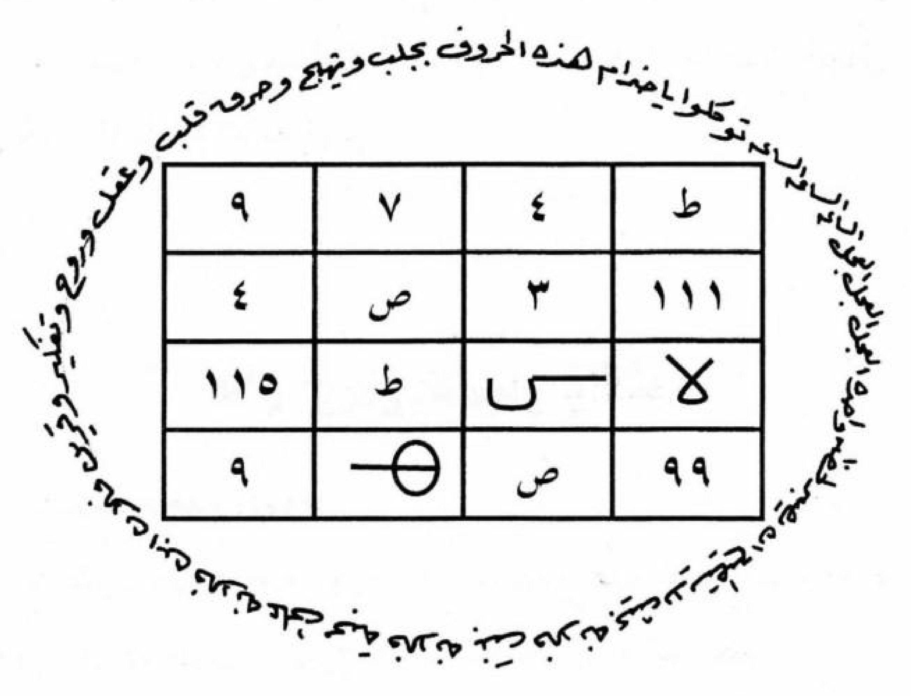

## Halaman PDF 35 (= cetak 45) — KHAATIM LI-HIFZHID-DAAR WAS-SAYYAAROH + 'ILAAJUL-AKZAMAH (ekzema) WA HABBISY-SYABAAB WASH-SHUDFIYYAH

**KHAATIM LI-HIFZHID-DAAR WAS-SAYYAAROH MINASY-SYARR WAL-HAWAADITS (khatam penjaga rumah dan kendaraan dari keburukan dan musibah):** ditulis pada rumah atau pada kendaraan atau pada kertas yang dibawa menurut naskah; akan (diklaim) terjaga dengan idzin Allah dari keburukan musibah dan dari wabah "balaa-as-sulthoon". Isi khatam adalah **tujuh baris kode huruf** (tulisan rajah — latinisasi perkiraan):

> *hiyaa aruuyaa-i — soomaa-yiqi maa-lih /
> hamaluu hahamu — saa-huu-nuwaa asraa-haa /
> adiyaa-nuwaa saa-haa-yil waahii /
> as-sahaa — sariimaa-roma adowaat /
> shofawaat — huw huw nuu awh laa*

**Telaah filologi:** bentuk baris-baris kode ini mirip majmu'ah "asma haa' tauniyat" di kitab-kitab syamsusy-syumuus; tidak berarti sesuatu bagi pembaca awam — maknanya pada lambang; kajian sekadar menandai susunannya tanpa tafsir/relaksasi penggunaannya.

**'ILAAJUL-AKZAMAH WA HABBISY-SYABAAB WASH-SHUDFANAH?** — obat untuk **ekzema, bruntusan (habby syabaab/jerawat), dan psoriasis (ash-shudafiyyah)**: 1 kg daun **dafalah** (nabuur) dan 1 kg garam kasar direbus dalam 5 liter air; setelah air tinggal setengah liter, airnya dioles pada bagian badan yang sakit beberapa hari (herbal topikal).

---

# BATCH 8 (Halaman PDF 36–40 = cetak 47, 46, 49, 50, 51) — cetak 48 hilang; cetak 47 & 46 tertukar dalam pindaian

## Halaman PDF 36 (= cetak 47) — penutup (sambungan cetak 46) + 'ILAAJU AALAMIL-AKTAAF WAR-RO'S

**Penutup bab sebelumnya:** penggalan kode nama — "...(wa zalii-kaaa?) bismi ... fii hubbi fulaan ibni fulaanatin binti fulaanah — bismillaah, ... haqqir-rohmaan haqqir-rohiim" *(penggalan rajah dari bab sebelumnya; tidak cukup potongan untuk ditelaah penuh pada bagian ini)*.

**'ILAAJU AALAMIL-AKTAAF WAR-RO'S (nyeri pundak dan kepala):** bahan-bahan — tiap 200 g: **handzhal** (henzala), **sadab** (inggu/ruta), **harmal**, **dibaaghur-rummaan (al-lib)** (jelai rebus? = tangkai-akar delima), **hantiit** (hinggu — asafoetida); ditumbuk bersama, ditambah minyak **al-fijal (al-murr? — lobak pahit)** dan cuka tua; diaduk sampai kental seperti lobak kuah kental, ditaruh dalam kantong selama dua minggu dan kemudian badan dioles padanya (herbal topikal).

## Halaman PDF 37 (= cetak 46) — 'ILAAJU DLO'FIL-BASHAR (penglihatan lemah) & LIS-SHULHI BAINAZ-ZAUJAINIL-MUTAKHOSHIMAIN

**'ILAAJU DLO'FIL-BASHAR:** ditulis pada bejana "*allaahu nuurus-samaawaati wal-ardh*" — "Allah Cahaya langit dan bumi" (QS. an-Nuur: 35); dimasukkan air hujan dan ditutup sepekan; dipakai sebagai tetes mata tiap hari selama 3 hari berturut pada bulan ganjil — satu, atau tiga, atau lima kali dalam bulan itu (menurut naskah), pada bulan yang berdampingan (bogort). **Telaah filologi:** ciri kalender ganjil / pembilang bulan ini umum dalam "wasfa" rakyat.

**LIS-SHULHI BAINAZ-ZAUJAINIL-MUTAKHOSHIMAIN (mendamaikan suami-istri yang saling berselisih):** ditulis pada kertas dengan za'faran:

> *Bismillaahir-rohmaanir-rohiim. Allaahumma innii alqaitu asmuka — anta llaahu, laa ilaaha illaa anta, wahdaka laa syariika lak, wa anna muhammadan 'abduka wa rosuuluk; lakal-mulku wa lakal-hamdu — tuhyii wa tumiitu; bi-yadikal-khair; wa huwa 'alaa kulli syay-in qodiir. Allaahumma ashlih lahumaa kamaa ashlihta baina Yuusuf ...*(bersambung halaman berikutnya)
> "Dengan nama Allah yang MahaPengasih lagi MahaPenyayang. Ya Allah, sungguh aku singgung nama-Mu: Engkaulah Allah, tiada tuhan selain Engkau, Esa, tiada sekutu bagi-Mu, dan Muhammad hamba serta utusan-Mu. Bagi-Mu kerajaan dan bagi-Mu pujian — Engkau menghidupkan dan mematikan; di tangan-Mu kebaikan; dan Dia Maha kuasa atas segala sesuatu. Ya Allah, damaikanlah atas mereka berdua seperti Engkau mendamaikan antara Yusuf..."

## Halaman PDF 38 (= cetak 49) — THILASM LIL-'IZZ WAL-JAAH (tilsam kemuliaan & kedudukan — bahan kajian)

Catatan naskah: ditulis dengan za'faran hari Ahad sebelum matahari terbit (*qobla thuluu-usy-syams*), dibawa bersama pemiliknya. **Rajahnya:** wafaq **5 baris × 4 kolom** berisi angka-angka tujuh-ratusan (٧١٧ hingga ٧٣٢) dan baris kata yang terbaca *"yaa — nuur — allaah... — muhammadi?؟"* di sisi atasnya garis tulisan rajah "*'amada jaa-akum ramuulun min anfusikum?*" *(kode hurufnya jarang terbaca jelas)*; di kiri-kanan lambang rajah. Tawakkal di bawah wafaq terbaca potongan:

> *Ta-amduru? jaa-akum — fulaa-ibni fulaanah...* — kajian hanya menandai bentuk bingkai tawakkalnya; tidak diuraikan perintahnya karena tidak bisa dibaca utuh *(kode rajah)*.

**Telaah filologi:** angka 717–732 adalah wafaq berbilang tsu"I'm laa-haa? — khas de'awwat ramal angka; bobotnya ada pada tujuannya (kemuliaan-kedudukan), bukan pada operasionalnya — kajian mendokumentasikan sisi formulanya.

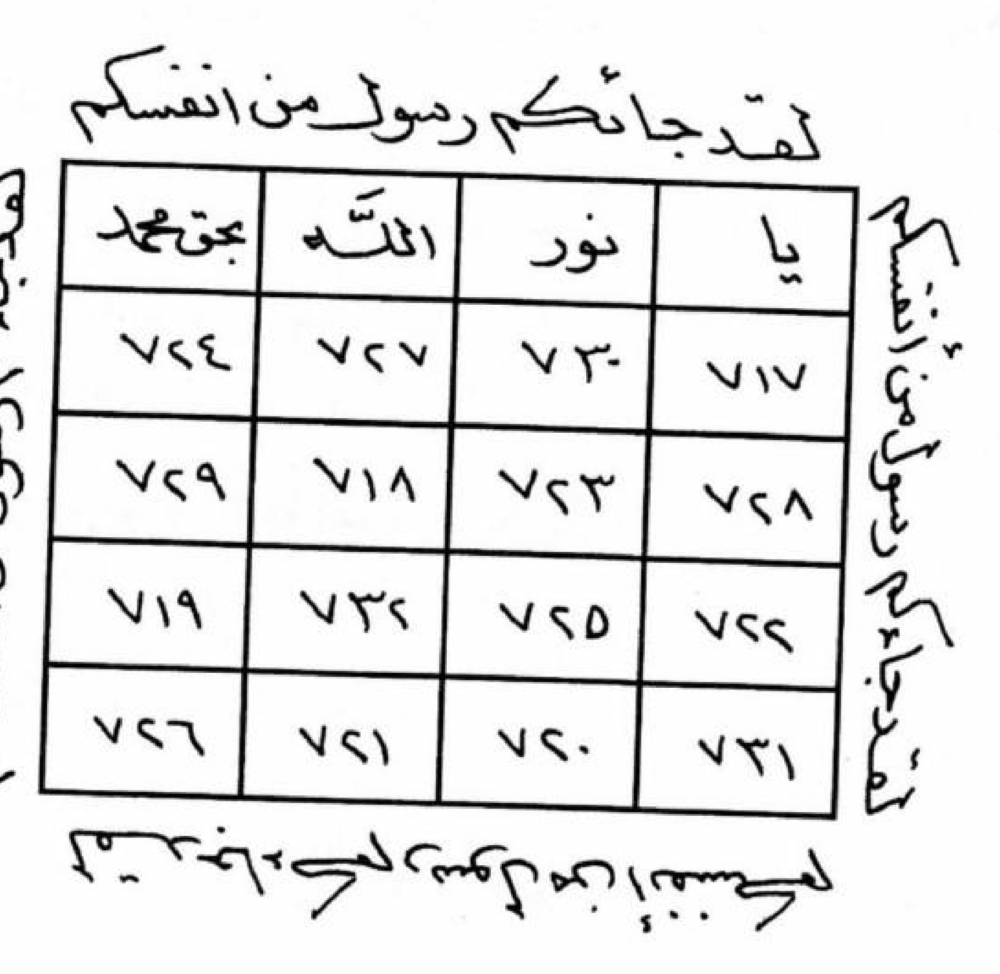

## Halaman PDF 39 (= cetak 50) — LITHARDIS-SIHR & penutup LITHARDIL-JINN (campur garam-cuka)

**LITHARDIS-SIHR WAL-JINN:** campuran garam dan cuka dibacakan:
- ayat **"jaa-al-haqqu wa zahaqal-boothil"** ("Telah datang yang haq dan musnahlah yang batil", QS. al-Israa': 81) **313 kali**;
- 71 kali ayat *"yaa ma'syarol-jinni wal-insi... laa tanfudzuuna illaa bi-sulthoon"* (QS. ar-Rahman: 33);
- doa permintaan: *"yaa man adzallas-saharota bi-'a'jaaza Muusaa — azla sihro as-sahara wa kaidal-fujjarto azalj? ... bi-qudratika bi-rohmatik"* — "wahai yang menghinakan penyihir-penyihir dengan mukjizat Musa, gugurkanlah sihir para penyihir dan tipu daya para pendurhaka dengan kudrat-Mu, dengan rahmat-Mu."

Rumah dicuci dengan cairan tersebut; diminum sebagai minuman seduhan (syaaih) tiap pagi perut kosong selama 3 hari (kajian).

## Halaman PDF 40 (= cetak 51) — penutup "LITHARDIL-JINN" + LIFAAKUL-QAID (memlonggarkan ikatan)

**Penutup:** (lanjutan dari cetak 50 — judul LITHARDIL-JINN ba'da Yasiin/Waaqi'ah/Rahman + ayat jinn 71 kali) — lalu "(al-Mu'awwidzatain) masing-masing 7 kali; garam dilarutkan dalam air dan dipakai mencuci (membasuh) rumah".

**LIFAAKUL-QAID (membuka ikatan — hajat keterperapan urusan):** naskah mencatat: shalat dua rakaat sebelum azan maghrib dengan niat "fakkul-qaid"; letakkan Al-Qur'an di atas kepala dan ucapkan:

> *Bi-haqqi haadzal-quraani, wa bi-kulli harfin fii haadzal-quraani — an tafukka qoidii anaa fulaanu-ibnu fulaanah.*
> "Demi kebenaran Al-Qur'an ini dan demi setiap huruf dalam Al-Qur'an ini — agar Engkau melepaskan ikatanku, aku Fulan bin Fulanah."

Lalu membaca surat **Yuusuf** dan **Yasiin** dan **doa al-masyhuul** dari kitab **Mafaatiihul-Jinaan**; diulang tiap Kamis tiga pekan. **Telaah filologi:** rujukan langsung ke kitab *Mafaatih al-Jinan* (kumpulan doa syaikh 'Abbas al-Qummi) — jejak jelas latar perpustakaan Syi'i penulisnya (tersusun pula di beberapa ungkapan "shollallaahu 'alaihi wa aalih").

---

# BATCH 9 (Halaman PDF 41–45 = cetak 52, 53, 54, 55, 57) — cetak 56 hilang dari pindaian

## Halaman PDF 41 (= cetak 52) — THILASM L'ILAAJISH-SHOR' (tilsam untuk epilepsi)

Naskah: *"wa huwa nafsut-thilasmil-musta'khdam lithardit-taa-bi'ah"* — **rajahnya sama persis** dengan rajah penanggalkan taabi'ah (hlm. 30): lingkaran besar lambang huruf rajah *(tidak terbaca jelas)*, dengan ketentuan pembakaran 12 potong kain yang dililit ke batang-batang lilin sebagaimana keterangan sebelumnya, dikerjakan menurut catatan di hammaam, dengan penjagaan *"ihdzar" — "perhatian/waspada"* yang dicatatkan khusus di ujungnya.

**Telaah filologi:** klasik dalam majmu'ah mujarrabat bahwa satu rajah bertugas ganda; kehadiran tulisan **"احذر"** di akhir bab (teks memperingatkan "berhati-hatilah") konsisten dengan pengakuan pemilik buku akan bahaya penyalahgunaannya.

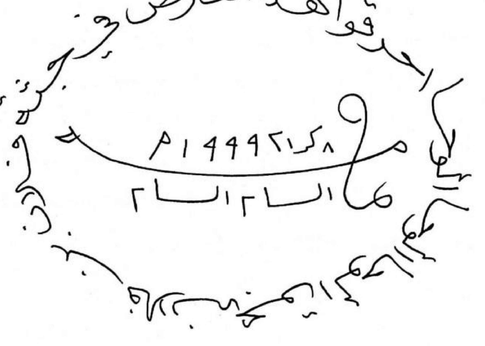

## Halaman PDF 42 (= cetak 53) — 'ILAAJU IDHTHIROOBIL-HORMUNAAT WAL-GHUDADIL-LIMFAAWIYYAH (gangguan hormon & kelenjar limfa) + pembuka LITAH-SIINIL-HAAL

**'ILAAJU IDHTHIROOBIL-HORMUNAAT:** campuran daun sidr, kapur kamfor dan yaas(?الكافور والياس), semua menjadi halus, berat total 1 kg; dibacakan pada campuran itu: surat Yaasiin 1×, Thaahaa 1×, Al-Fatihah **71 kali**, Aayatul-Kursi 7×, dan al-Mu'awwidzatain masing-masing 7×; dibagi dua: separuh dipakai membasuh badan pada hari Rabu, Kamis dan Jumat; separuh lagi diambil sebagai minuman — 1 sendok teh ditambahkan pada segelas air saat perut kosong, sepekan (kajian).

**LITAH-SIINIL-HAAL (memperbaiki keadaan):** ditulis pada kertas **ayat pertama dari tiap surat Al-Qur'an** dan **Asmaaul-Husna** yang bermakna kelembutan dan kasih-sayang (seperti al-Lathiif, al-Waduud, ar-Rohiim, ar-Rahman, ar-Roof, dll.) — tiap nama 7 kali; dan basmalah 7 kali; dan ayat "*idzaa jaa-a nashrullaahi wal-fath*" ("Apabila datang pertolongan Allah dan kemenangan", QS. an-Nashr) — *(lanjutan ke halaman berikut)*.

## Halaman PDF 43 (= cetak 54) — penutup LITAH-SIINIL-HAAL + LIZAALATIL-'AARIDH WAL-JIN (versi ayat ash-Shaaffaat — diklaim paling kuat)

**Penutup (cetak 53 bawah):** ... kemudian **nama orangnya ditulis (fulaan ibni fulaanah)**; setelah itu kertas dibakhar dengan bukhur, dilipat, dan dibawa oleh pemilik hajat.

**LIZAALATIL-'AARIDH WAL-JINN WA HUWA FA"AAL JIDDAN** — dicatat sebagai amalan "sangat kuat": ditulis dengan za'faran pada kertas **Asmaaul-Husna seluruhnya** dan ayat-ayat berikut (dengan penuh):

> *Baroo-atun minallaahi wa rosuulihii ilalladziina 'aahadtum minal-musyrikiin* — "Pembebasan dari Allah dan Rasul-Nya atas orang-orang musyrik yang kamu ikat perjanjian" (QS. at-Taubah: 1);
> *Wash-shooffooti shoffaa. faz-zaajirooti zajroo. fat-taaliyaati dzikroo. inna ilaahakum lawaahid* — "Demi (para malaikat) yang berbaris-baris; dan golongan yang menghardik; dan golongan yang membaca pemberitahuan. Sungguh Tuhanmu adalah Yang Maha Esa" (QS. ash-Shaaffaat: 1–4), lalu:
> *robbus-samaawaati wal-ardhi wa maa bainahumaa, wa robbul-masyaariq — innaa zayyannas-samaa-ad-dunyaa bi-ziinatinil-kawaakibi, wa hifzhon min kulli syaythoonim-maarid. Laa yassamma'uuna ilal-mala-il-a'laa, wa yuqzafuuna min kulli jaanib; duhuuran, wa lahum 'adzaabun waasib; illaa man khothifal-khothfah fa-athba'ahuu syihaabun tsaaqib* — "Tuhan langit-langit dan bumi dan apa di antara keduanya dan Tuhan penjuru timur. Kami hiasi langit dunia dengan perhiasan (bintang), dan Kami jagalah dari tiap setan yang durhaka. Mereka tak bisa mencuri pendengaran di majelis tinggi — dari segala penjuru mereka dilontar, diusir, dan siksa kekal bagi mereka. Kecuali siapa yang mencuri-curi pendengaran, ia dikejar oleh kilat penembus" (QS. ash-Shaaffaat: 5–10).

Setelah itu kertas diletakkan di dalam air dan dibacakan surat **at-Tahriim** dan **al-Jinn**; air itu diminum pada hari Selasa, Rabu dan Kamis, dan sisanya dipakai berwudhu sebelum azan zhuhur (kajian).

## Halaman PDF 44 (= cetak 55) — THILASM LIL-JAM'-I BAINA AL-AHIBBAH (tilsam "penghimpun kasih" antar yang saling mengasihi)

Catatan naskah: ditulis pada **kertas tujuh kali** (ujungan/unda, permintaan dari nama pertama sampai nama yang kedua), ditimbun di rumah; **di sekelilingnya disalin surat an-Nisaa'** dalam bentuk empat belahan lambang di tiap sudut wafaq. **Rajahnya** adalah **wafaq 4×4** yang semua selnya berisi angka-angka panjang tiga-empat digit (umumnya berawalan ٣١٦٤ — misalnya ٣١٦٤٧٧, ٣١٦٤٨٢, ٣١٦٤٨٥, ٣١٦٤٧١, ٣١٦٤٧٣, ٣١٦٤٦٦, ٣١٦٤٧٦, ٣١٦٤٨١, ٣١٦٤٧٠, ٣١٦٤٨١١ — dan dua sel yang berbeda: ٢٨ dan ٨١١) — *(pembacaan beberapa sel tidak pasti karena goresan tangan tipis — angka wafaq dicatat secara visual)*. Tawakkal di bawahnya:

> *Tawakkaluu yaa khodaama surotin-nisaa-i — waj'aluu fulaan ibni fulaanah yahwu fulaanah binti fulaanah — kamaa tahow-wa/tahwya? zailikhoo Yuusufa, wa kamaa tahaw-wa ummu muusaa ibnahaa, wa kamaa ahabba muhammadun shollallaahu 'alaihi wa aalihi ash-haabahu — fii badra(il??)-al-'ajal al-'ajal.*
> "Tunaikanlah, wahai para khadam surat an-Nisaa': jadikanlah Fulan bin Fulanah mencintai Fulanah binti Fulanah — sebagaimana Zulaikha mencintai Yusuf, sebagaimana ibu Musa (terikat pada) anaknya, dan sebagaimana Muhammad shollallaahu 'alaihi wa aalih mengasihi para sahabatnya — dengan segera, cepatlah."

**Telaah filologi:** bab "jam' (penghimpun rasa)" ini sama kategorinya dengan hubb-'asyq — fikriyat; di kajian sekadar direkam susunan wafaqnya.

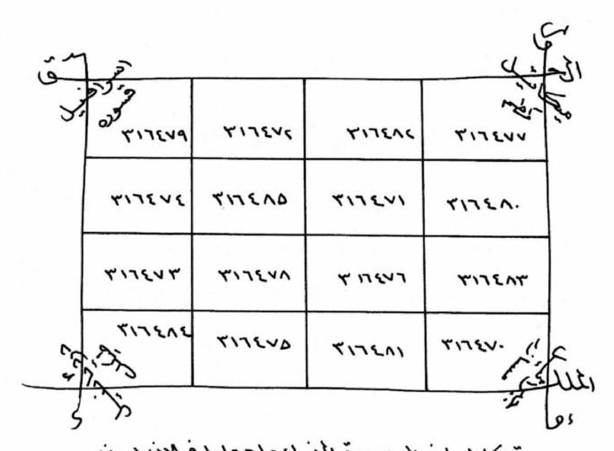

## Halaman PDF 45 (= cetak 57) — LITAGH-YIIRIL-HAAL FA'AALAH JIDDAN + LIQADHAA 'ALAS-SIHR WAT-TAA-BI'AH + pembuka AUJAA'IL-KATIF

**LITAGH-YIIRIL-HAAL (mengubah keadaan — diklaim sangat kuat):** ditulis dengan za'faran **basamalah 365 kali** selesai pada jam 11 pagi, dibawa bersamanya (365 — bilangan hari setahun).

**LIQADHAA 'ALAS-SIHR WAT-TAA-BI'AH (membunuh/memusnahkan sihir & roh pengikut):** dibaca (menurut naskah): surat **ash-Shaaffaat 3 kali**, **sholawat 1000 kali**, lalu:

> *Allaahumma-ij'al lii minash-sholaati 'alaa muhammadin wa aali muhammad tabdiila haalin min suu-in ilaa ahsanin, bi-haqqi muhammadin wa aali muhammad.*
> "Ya Allah, jadikanlah bagiku melalui shalawat atas Muhammad dan keluarganya pergantian keadaan dari yang buruk kepada yang terbaik — demi kebenaran Muhammad dan keluarganya."

**L'ILAAJI AUJAA'IL-KATIF WAZH-ZHUR (nyeri pundak dan punggung):** surat al-Waaqi'ah ditulis dengan za'faran; diletakkan dalam minyak zaitun; dioles pada pundak dan punggung (kajian).

---

# BATCH 10 (Halaman PDF 46–50 = cetak 58, 59, 61, 60, 62) — pasangan contak 61/60 juga tertukar dalam pindaian (inversi POSISI ke-2)

## Halaman PDF 46 (= cetak 58) — THILASM LIL-MAHABBAH (tilsam mahabbah/kasih-menarik hati)

Instruksi: ditulis pada kertas dengan za'faran **hari Sabtu sebelum terbit matahari**, dibawa oleh pengamalnya. **Rajahnya:** **wafaq 3×3** berangka (٦٢٧, ٦٢١, ٦٢٢ / ٦٢٨, ٦٢٣, ٦١٩ / ٦٢٤, ٦٢٦, ٦٢٠) di dalam **lingkaran** yang dipenuhi pengulangan nama **"wadud" (ودود)** dan lambang **وي۶٩٦** — wadud = Yang Maha Pengasih-Mencinta. (kajian).

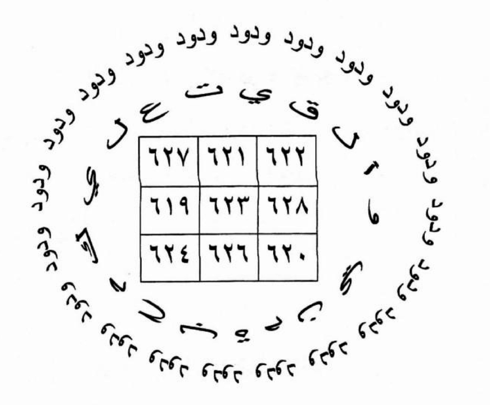

## Halaman PDF 47 (= cetak 59) — LIS-SIHR WAL-JINN (bahan) + LIL-'AARIDH (bahan dupa)

⚠ **Peringatan keras — kategorinya dhoroor:** **LIS-SIHR WAL-JINN (FA"AAL MUJARRAB)** menuliskan penggunaan **kepala kambing hitam** yang direbus airnya, dipakai membasuh rumah dengan air rebusan itu, lalu kepala ditimbun di ambang pintu rumah atau di kebun. Berdasarkan wasiat *Laa tasta'milhu illaa fii maa yurdlhillah* dan kaidah *laa dhororo wa laa dhiroro*, bab ini **tidak ada satupun bagian yang dapat dipraktikkan** (bangkai-penguburan-najis, hierarki i'tikod yang memakai media hewan); di kajian hanya dicatat keberadaannya sebagai celim takhayyul yang diselingkan penulis di antara bahan-bahan sholih.

**LIL-'AARIDH (bahan dupa):** campur dan satukan: sandaruus 50 gr, harmal 50 gr, biji khorruub 50 gr, khardal 50 gr, hantiit (hinggu) 50 gr, thobaasyiir 50 gr, handzhal 50 gr, libaan dzakar (kemenyan jantan) 50 gr, sadab murr (inggu laut) 50 gr — *(lanjut PDF 49 pada cetak 60 bawah)*.

## Halaman PDF 48 (= cetak 61) — (penutup bab Amiryyaat? sebelumnya) + LIR-RIZQ + LIZZAWAAJ (pembuka)

Penutup bab: "...supaya selesai pada hari Kamis sebelum azan maghrib, lalu bersujud dan mengucapkan saat sujud **seratus kali: 'Subbuuhun Qudduusun Robbul-malaa-ikati war-ruuh'** ('Maha Suci, Maha Kudus, Tuhan para malaikat dan ar-Ruuh')."

**LIR-RIZQ (pintu rizki):** dibaca 1000 kali "**yaa hayyu yaa qoyyuum**" pada pukul satu setelah tengah malam selama seminggu; lalu didoakan:

> *As-aluka bi-haqqil-Quraani wa tilaawatih — wat-Tawroh wa maa fiihi wal-Injiil wal-Zabuur — wa hamalati 'arsyikal-kariim. As-aluka bi-yaa-siin wal-Imaamil-mubiin — illa? mal ghairota haalii bi-husni haalik.*
> "Aku memohon kepada-Mu dengan kebenaran Al-Qur'an dan membacanya, dengan Taurat dan isinya, Injil, Zabur dan para pembawa 'Arsy-Mu yang mulia. Aku mohon dengan kebenaran Yaasiin dan 'Imam yang nyata — agar Engkau mengubah keadaanku dengan kebaikan keadaan-Mu."

**LIZZAWAAJ (pernikahan/menjemput jodoh):** ditulis pada kertas dengan air mawar dan za'faran: "*bil-qalam bahr(?) ilallaili wan-nahaar bismillaahi ta'aalaa wa nuzzila minal-Qur-aani maa huwa syifaa-ur-rohmoh lil-mu'miniin...*" ("dengan pena ... kepada malam dan siang; dengan nama Allah Yang Maha Tinggi; dan Kami turunkan dari Al-Qur'an apa yang menjadi penawar dan rahmat bagi kaum mukminin", al-Israa': 82) — *(lanjut)*.

## Halaman PDF 49 (= cetak 60) — penutup bahan dupa + LIL-AR-THIBAATH WAL-ZAWAAJ + LITHARDIL-QORIIN WAT-TAABI'AH (pembuka)

**Penutup dupa (cetak 60 atas):** ... + **cuka asam (khollu haamidh) 50 gr**; semua bahan diuleni, dikeringkan di tempat teduh; dipakai membakhar penderita ('aaridh) pada pagi dan petang selama sepekan (kajian).

⚠ **LIL-IR-THIBAATH WAS-ZAWAAJ (untuk pengikatan pernikahan):** naskah menulis — diambil 21 butir merica; dibacakan oleh **gadis yang belum baligh seratus kali surat at-Tauhiid**, lalu dibakar dengan niat mengikatkan pernikahan si Fulan bin Fulanah kepada Fulanah binti Fulanah. Kategori **fikriyyat/ir-thibaath** ini sama hukumnya (perbuatan bertujuan menetapkan pasangan secara ghoib, batil) — **tidak boleh dipraktikkan**; dicatat di kajian.

**LITHARDIL-QORIIN WAT-TAABI'AH (menanggalkan qoriin & taabi'ah yang mengikuti):** dimulai **wudhu pada hari Sabtu, bernadzar mengkhatamkan Al-Qur'an untuk ar-Rasulil-A'zham (shollallaahu 'alaihi wa aalih)** dengan niat tersebut; mulai membaca mushhaf pada hari Ahadnya — *(tutupan/unggahan khatamnya lanjut halaman berikut)*.

## Halaman PDF 50 (= cetak 62) — penutup LITHARDIL-QORIIN + 'ILAAJUL-'AQM WANSIDARD? WAN-SIDAAD QONAWAATIR-ROHM (kemandulan & sumbatan saluran rahim — bahan)

**Penutup khatam qoriin:** ditutup dengan deratan asma: **"ا — ء ، ح — م ، و" (alif-hamzah-haa-miim-waw) dan bilangan ١١١١٩١١١** khusus *(lambang gundul tidak terbaca rinci; ditulis apa adanya)*; lalu kertas ditaruh dalam air, dipakai mandi sepekan; setelah berakhir pekannya dibaca **Tiap Kamis dan Jumat sebelum subuh** selama dua pekan: surat **al-Faatihah, al-Mu'awwidzatain, Alam-Nasyrah (ash-Syarh) dan Idzaa jaa-a** (kajian).

**L'ILAAJIL-'AQM WA INSIDAADI QONAWAATIR-ROHHIM 'INDAL-MAR-AH** (mandul dan tersumbatnya saluran rahim pada perempuan — bahan): biji **rasydaad** (tumbuhan selada-air) 50 gr, biji **karafs** (seledri) 50 gr, biji **fijal** (lobak) 50 gr, biji bawang 50 gr, biji **qurfah** 50 gr, biji **kronful** (cengkih) 50 gr, **habbatus-saudaa** (jintan hitam) 50 gr — *(lanjut)*.

---

# BATCH 11 (Halaman PDF 51–55 = cetak 63, 64, 65, 66, 67)

## Halaman PDF 51 (= cetak 63) — penutup 'ILAAJUL-'AQM (bahan mandul) + LUJALB/LIJALBIL-GHAA-IB (memanggil yang hilang) + pembuka TAWAKKAL LITAHSIINIL-HAAL

**Penutup bahan (kemandulan):** *"Tukhlatu haadzihil-budzuur sawiyyah wa tunqa'u bil-maa-i limuddata arba'ati ayyaam tsummu yusyrabu minhaa nishfu kuubi syaay yaumiyyan fish-shabhi wal-maghribi limuddata 21 yauman."* — "Semua biji-bijian itu dicampur merata lalu direndam air selama empat hari; kemudian diminum setengah cangkir teh setiap pagi dan petang selama 21 hari." (kajian bahan 'a-syaab, dicatat sebagaimana naskah).

**LIJALBIL-GHAA-IB (menjemput orang yang pergi/absen):** dibaca **surat Yaasiin** sedangkan orangnya berada di atas atap rumah, kemudian bersujud dan mengucapkan 100 kali:

> *"Subhaanal-ladzii biyadihi malakuutu kulli syai-in wa ilaihi turja'uun — yaa mughiits yaa mughiits yaa mughiits."*
> "Maha Suci Tuhan yang di tangan-Nya kerajaan segala sesuatu dan kepada-Nya kamu kembali — wahai Sang Penolong, wahai Sang Penolong, wahai Sang Penolong."

**Telaah filologi:** potongan *"biyadihi malakuutu kulli syaiin wa ilaihi turja'uun"* adalah ujung QS Yaasiin ayat 83; isinya murni tasbih dan isytaaq (rindu-minta pertolongan) — kategori dzikir, tidak ber-media rajah.

**Pembuka TAWAKKAL LITAHSIINIL-HAAL MUHIMMUN JIDDAN (tawakkal memperbaiki keadaan — dinilai penulis "sangat penting"):** ditulis dengan **za'faran pada awal bulan Muharram** (hari pertama atau kedua), pukul sebelas siang, pada **pita kertas sepanjang tubuh orang yang dimaksud**, dimulai dengan **muqaddimaat/mukaddimah surah-surah Al-Qur'an (ayat pertama** — lanjut halaman berikut).

## Halaman PDF 52 (= cetak 64) — penutup TAWAKKAL + LIZ-ZAWAAJ AU LIL-INJAAB (untuk pernikahan atau keturunan)

**Penutup: tawakkal memperbaiki keadaan** — (sambungan) "...**dari setiap surah**, didahului penulisan **basmalah**; setelah itu ditulis tawakkal ini:"

> *"Allaahumma as-aluka bismikal-'azhiimith-thaahirith-thuhr — Allaahumma as-aluka bi-haqqi muhammadin wa 'aliiy wa faathimah wal-hasan wal-husain — an tughayyira haala fulaan ibni fulaanah bi-husni haalik."*
> "Ya Allah, aku memohon kepada-Mu dengan nama-Mu yang agung lagi suci; Ya Allah, aku memohon dengan haq Muhammad, Ali, Fathimah, Hasan dan Husain — agar Engkau mengubah keadaan si Fulan bin Fulanah dengan kebaikan keadaan-Mu."

**Telaah filologi:** struktur tawassul lima nama Ahlul Bayt ini adalah corak do'a khas lingkungan mujarrobat Siria/Irak bermazhab cinta-Ahlul-Bayt; kajian mencatatnya sebagai wujud retorika penyusun, bukan tafsir hukum.

**LIZ-ZAWAAJ AU LIL-INJAAB (untuk menikah atau mendapat anak):** pada **Jumat terakhir bulan Ramadhan** dikerjakan **shalat hajat** dengan niat pernikahan atau keturunan, lalu dibaca **surat Thaahaa 3 kali**, setelahnya didoakan:

> *"Allaahumma as-aluka bi-qudratikal-latii tughayyiru bihal-asyyaa' — Allaahumma as-aluka bi-'izzatik wa jalaali haiibatik wa 'azhiimi qudratik wa fii ma'qili 'izzik — wa as-aluka bismikal-ladzii taquulu bihi lisy-syai-i kun fa-yakuun — as-aluka an tushalliya 'alaa muhammadin wa aali muhammad — wa an taj'ala lii farajan bish-sholaati 'alaa muhammadin wa aali muhammad."*
> "Ya Allah, aku memohon kepada-Mu dengan kekuasaan-Mu yang dengannya Engkau mengubah segala sesuatu; Ya Allah, aku memohon dengan keperkasaan-Mu, keagungan kewibawaan-Mu, besarnya kekuasaan-Mu dan benteng keperkasaan-Mu; dan aku memohon dengan nama-Mu yang dengannya Engkau berfirman kepada sesuatu 'jadilah' maka jadilah ia; aku memohon agar Engkau melimpahkan shalawat atas Muhammad dan keluarganya, dan agar Engkau beri aku jalan lapang berkat shalawat atas Muhammad dan keluarganya."

Lalu bersujud dan membaca: ***"Rabbi laa tadzarnii fardaw-wa anta khairul-waaritsiin"*** — "Ya Tuhanku, janganlah Engkau biarkan aku seorang diri, padahal Engkaulah pewaris yang terbaik" (QS al-Anbiyaa': 89 — do'a Nabi Zakariyya memohon keturunan; sangat cocok dengan judul bab).

## Halaman PDF 53 (= cetak 65) — THILASM LIR-RIZQ (rajah pintu rizki untuk ditukang di pintu toko)

Menurut teks: tilsam ini **ditulis pada kertas dan digantung di pintu toko atau tempat usaha**. Rajahnya membawa ayat:

> **«Innal-ladziina yatluuna kitaabal-laah wa aqaamush-sholaatah wa anfaquu mimmaa razaqnaahum sirraw-wa 'alaaniyyah yarjuuna tijaaratal-lan tabuur — liyuwaffiyahum ujuurahum wa yaziidahum min fadhlih, innahuu ghafuurun syakuur»**
> "Sungguh orang-orang yang selalu membaca Kitab Allah, mendirikan shalat dan menginfakkan sebagian rizki yang Kami anugerahkan kepadanya secara sembunyi dan terang-terangan, mereka itulah yang mengharapkan perdagangan yang tidak akan rugi — agar Allah menyempurnakan pahala bagi mereka dan menambahkan dari karunia-Nya. Sungguh Allah Maha Pengampun lagi Maha Mensyukuri." (QS Faathir: 29–30)

Di bawah ayat ada susunan lambang (kajian): **segitiga**, **bintang segi enam**, tulisan-tulisan gundul khas rajah (di antaranya terbaca **"الـم ش ر ع / الـم ف ر ع"** dan bentuk **"و ها١١١١"/ waw-haa dan empat angka satu** serta kotak-kotak kecil kosong) *(unsur rajah — tidak diberi talaqqi; maknanya sesuai khazanah 'ilmu-huruuf penyusun)*, lalu penggalan ayat:

> **«Wa man aufaa bi-'ahdihii minal-laah — fastabsyiruu bi-bai'ikumul-ladzii baaya'tum bihi — wa dzaalika huwal-fauzul-'azhiim»**
> "...dan siapa yang menepati janjinya kepada Allah — maka bergembiralah dengan jual-beli yang telah kamu janjikan itu; dan yang demikian itulah kemenangan yang besar." (QS at-Taubah: 111, dikutip dengan redaksi gaya naskah)

**Telaah filologi:** pilihan dua ayat "tijaarah-lan-tabuur" dan "fastabsyiruu bi-bai'ikum" menunjukkan susun-susun (*tahaqquq*) rajah rizki: seluruh "kekuatan" rajah dipasrahkan pada ayat, bukan pada lambang — tetapi lambang-lambang itu tetap dicatat sebagai bahan budaya dan **tidak** diberi cara penggunaannya.

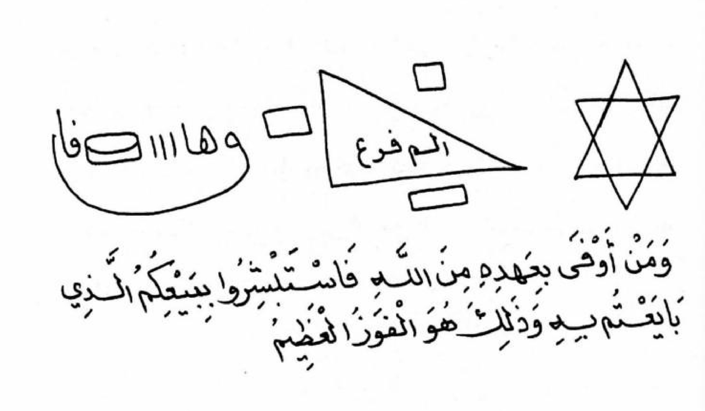

## Halaman PDF 54 (= cetak 66) — KHAATIM LI-IZAALATIS-SIHR (khatam penanggulang sihir — teks tanpa gambar)

Menurut teks: khatam ini **ditulis pada kertas; ditaruh di muka rumah atau dibawa dalam saku**. Susunan teksnya (ditranskripsikan apa adanya — kode angka/huruf dibaca seperti tertulis):

> **ط ٥ ١٨٨١**
> **م ١١١ ومره مر لا ١ ط ط د**

(pembacaan: *thaa' — 5 — 1881 ; miim — 111 — wa-marra — mar — laa — 1 — thaa' — thaa' — daal*; kode-kode semacam ini dalam tradisi bilangan ('adadiyyaat) biasanya dipecah dari **nilai abjad** sebuah nama/ayat; tanpa kunci penyusun kita **tidak menduga-duga isinya** — dicatat bentuknya saja.)

Lalu teks utamanya:

> *"Yaa haafizh, yaa hayy, yaa qayyuum — «lau anzalnaa haadzal-qur-aana 'alaa jabalil-la-ra-aitahuu khaasyi'am-mutashaddi'am-min khasyyatillaah — wa tilkal-amtsaalu nadhribuhaa lin-naasi la'allahum yatafakkaruun» — Allaahummasyfi man lahul-balaa-u saahibah — bi-haqqi yaa «wa nunazzilu minal-qur-aani maa huwa syifaa-uw-wa rohmatul-lil-mu'miniin wa laa yaziiduzh-zhoolimiina illaa khosaaro» — kahlaa kahlaa — irham irham — tarham tarham — 'aqadtum farqiis farqiis — al-'ajal al-'ajal — al-wahaa al-wahaa — as-saa'ah as-saa'ah."*

Terjemahan bagian yang berbahasa: "Wahai Sang Penjaga, wahai Yang Hidup, wahai Yang Berdiri-menegakkan — *«Kalau Kami turunkan Al-Qur'an ini kepada gunung, niscaya engkau melihat gunung itu tunduk lagi pecah karena takut kepada Allah; perumpamaan-perumpamaan itu Kami kemukakan kepada manusia agar mereka berpikir»* (QS al-Hasyr: 21) — Ya Allah sembuhkanlah siapa yang ditimpa bala' ini — demi kebenaran *«Dan Kami menurunkan dari Al-Qur'an apa yang menjadi penawar dan rahmat bagi kaum mukminin, sementara bagi orang zalim hanya menambah kerugian»* (QS al-Israa': 82) — *kahlaa-kahlaa* (bentuk ajakan khas rajah, tidak berbahasa), kasihanilah, kasihanilah; *farqiis-farqiis* (nama khadam menurut kunci naskah) — cepat, segera, sekarang."

**Telaah filologi:** walaupun judulnya "izālatus-sihr", isi khatam ini ayat murni + panggilan asma + deretan "al-'ajal/al-wahaa/as-saa'ah" (pola penutup rajah umum). Kajian mencatat polanya; **bentuk sumpah/kontak-khadamnya tidak diberi panduan pakai**.

## Halaman PDF 55 (= cetak 67) — THILASM LIL-MAHABBAH (wafaq mahabbah Sabtu — analisis filologi)

Menurut teks: ditulis dengan **za'faran pada kertas, hari Sabtu sebelum terbit matahari**, lalu dibawa. Di atas wafaq tertulis potongan firman:

> **«Wa ulqiitha 'alaika mahabbatam-minnii wa li-tushna'a 'alaa 'iinii»**
> "Dan Aku limpahkan kepadamu kasih-sayang yang datang dari-Ku, agar engkau dibesarkan di bawah pengawasan-Ku." (QS Thaahaa: 39 — wahyu tentang bayi Musa)

Wafaq-nya **rubaa'iy/tsulaatsiy 3×3** berangka (dari kanan ke kiri): **1361 – 1330 – 1363 / 1368 – 1344 – 1366 / 1367 – 1340 – 1369** *(pada sel tengah bawah manuskrip menulis angka yang agak kabur, dibaca 1340 menurut bentuk baris)*; setiap sudut wafaq diberi lambang kecil khas rajah. Deretan bilangan empat angka di tradisi **'ilmu wafaq** umumnya berputar di sekitar jumlah tertentu yang dianggap "kunci nama" oleh penyusun; kajian tidak memecahkannya lebih jauh dari bentuk tertulis.

Di bawah wafaq tertulis bentuk tawakkal, ditranskripsikan:

> *"Tawakkaluu yaa khodaama haadzihil-aayaat bijalbi mahabbatii fii quluubin-naas au fii qolbi fulaan ibni fulaanah. Uqsimu 'alaikum bi-quwwatillaah — uqsimu 'alaikum bi-qudratillaah — uqsimu 'alaikum bi-'izzatillaah."*
> "Laksanakanlah, wahai para khadam ayat-ayat ini: hadirkanlah cinta-kasihku di hati manusia atau di hati si Fulan bin Fulanah. Aku bersumpah atas kalian dengan kekuatan Allah — dengan kekuasaan Allah — dengan keperkasaan Allah."

**Telaah filologi:** kategori mahabbah termasuk **jalbu-shughl** (menarik hati) — kajian merekam susunannya (ayat Thaahaa: 39 + wafaq + tawakkal tiga sumpah pada sifat Allah), **tanpa petunjuk praktik**; terjemajan diberi agar isi teks tuntas terbaca.

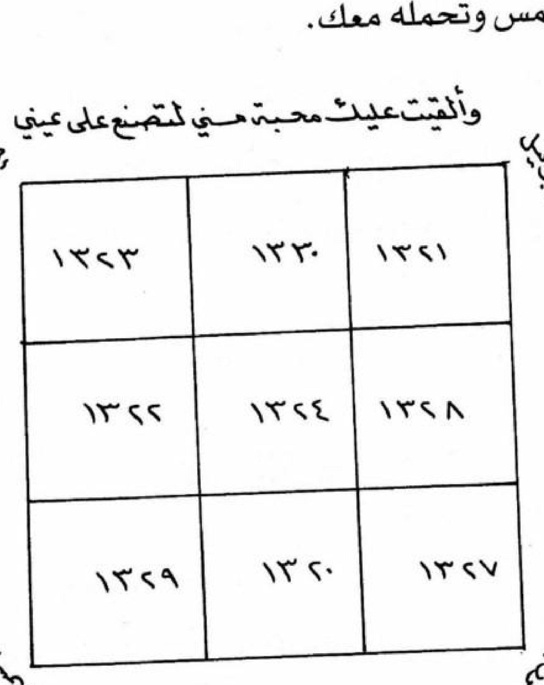

---

# BATCH 12 (Halaman PDF 56–60 = cetak 68, 69, 70, 71, 73) — cetak 72 dan 74 tidak ada dalam pindaian; cetak 73 (awal Daftar Isi) menyusul di sini

## Halaman PDF 56 (= cetak 68) — LIR-RIZQ (tulisan za'faran sebelum zhuhur) + 'ILAAJUL-QURHAH (obat tukak/lambung — bahan)

**LIR-RIZQ:** menurut teks, ditulis dengan **za'faran pada kertas sebelum shalat zhuhur**:

> *"Yaallaah yaallaah yaallaah — yaa hayyu yaa qayyuum (3 kali) — yaa dzal-jalaali wal-ikroom (3 kali) — as-aluka bismikal-a'zhami an tarzuqonii rizqon halaalan thoyyiban bi-rohmatikal-waasi'ah — yaa dzal-ma'ruufil-ladzii laa yanqothi'u abadan wa laa yuhshiihi 'adadan."*
> "Ya Allah, Ya Allah, Ya Allah — wahai Yang Hidup, wahai Yang Berdiri-menegakkan (3 kali) — wahai Pemilik Keagungan dan Kemuliaan (3 kali) — aku memohon kepada-Mu dengan nama-Mu yang paling agung agar Engkau karuniakan kepadaku rizki yang halal lagi baik, dengan rahmat-Mu yang luas — wahai Pemilik kebajikan yang tidak pernah putus selamanya dan tidak terhitung bilangannya."

**Telaah filologi:** seluruhnya untaian tawassul asmaul-husna (al-Hayy, al-Qayyuum, Dzuul-Jalaali wal-Ikraam, al-Ma'ruuf) — kategori dzikir, tidak memakai rajah.

**'ILAAJUL-QURHAH (obat tukak — bahan dapur):** menurut teks — **otak domba** dimasak setengah matang lalu dicampur **minyak zaitun**, dimakan setelah menahan diri dari makan selama 3 jam; kemudian **ampas/sum-sum yang ada di dalam perut buah delima** dicampur dengan **jus pisang** lalu dimakan; pekerjaan ini diulang **tujuh hari** (bahan thibb-shaahib/populer, dicatat kajian; tidak ada unsur ruhani).

## Halaman PDF 57 (= cetak 69) — THILASM FA'AAL WA MUJARRAB LIR-RIZQ (spiral huruf — halzuuni)

Menurut teks: *"wa huwa thilasmun quwiyyun jiddan — tukatabuhu 'alaa ihdoo jidraanil-manzil fii makaanin ghairil-mar-i."* — rajah ini "tilsam yang sangat kuat; ditulis pada salah satu dinding rumah di tempat yang tak terlihat" (seperti kolong/atap).

**Bentuk rajah:** huruf-huruf terputus besar dan kecil tersusun **melingkar spiral** (corak *halzuuni*) mengecil ke pusat; pada beberapa lintasan terbaca potongan-potongan (sesuai kemampuan baca): "**dam-haa-miim / laa-waw-daal-miim-haa / thaa-qaaf-thaa-alif-raa-haa / alif-lam-daal...**" dan jeruji angka/huruf rapat *(rajah — tidak terbaca penuh; ditulis apa adanya)*. Lambang ini golongan **khootim halzuuni** (lingkar-pilin huruf majmu') yang di kalangan penulis rajah dihormati sebagai "benteng asma"; kajian hanya memetakan bentuknya, **tidak** menyampaikan bacaan/kunci apa pun.

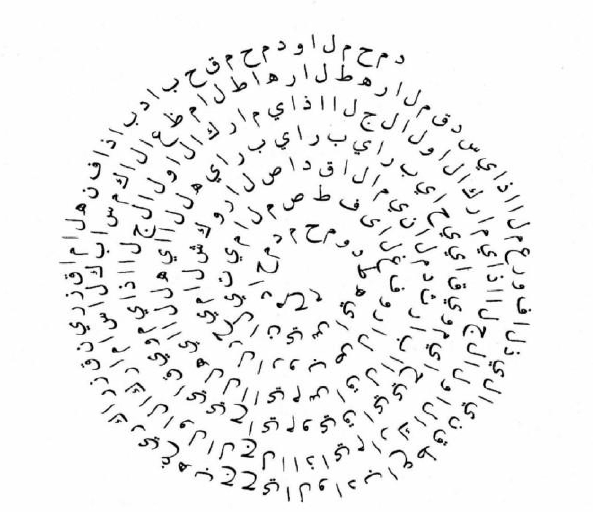

## Halaman PDF 58 (= cetak 70) — LIJALBIR-RIZQ MUJARRAB WA FA''AAL (wafaq kalimat surat an-Nashr)

Menurut teks: *"tukatibuhu biz-za'faraan 'alaa waroqatin wa yuudha'u fil-manzil."* — ditulis dengan za'faran di kertas dan disimpan di rumah.

**Bentuk rajah:** **wafaq kalimaat** (bukan angka): sebuah kotak besar dibagi sel-sel (pada naskah: 9 kolom × 10 baris = 90 sel) yang **diisi kata per kata dari QS an-Nashr**, disusun **mundur-menyilang dari sel kanan-atas** sehingga rangkaiannya berjalan diagonal:

> **«Idzaa jaa-a nashrullaahi wal-fath — wa-ro-aitan-naasa yadkhuluuna fii diinillaahi afwaajan — fa-sabbih bi-hamdi robbika wastagfirh — innahuu kaana tawwaabaa»**
> "Apabila telah datang pertolongan Allah dan kemenangan, dan engkau melihat manusia berbondong-bondong masuk agama Allah, maka bertasbihlah dengan memuji Tuhanmu dan mohonlah ampunan kepada-Nya; sungguh Dialah Yang Maha Penerima taubat." (QS an-Nashr: 1–3)

**Telaah filologi:** teknik wafaq-kalimah begini = memedakan ayat ke sel-sel untuk "menggenggam" keseluruhan surat pendek dalam satu gambar; an-Nashr populer di tradisi rizki (karena ungkapan "nashr" dan "fath"). Kajian mencatat susunannya saja.

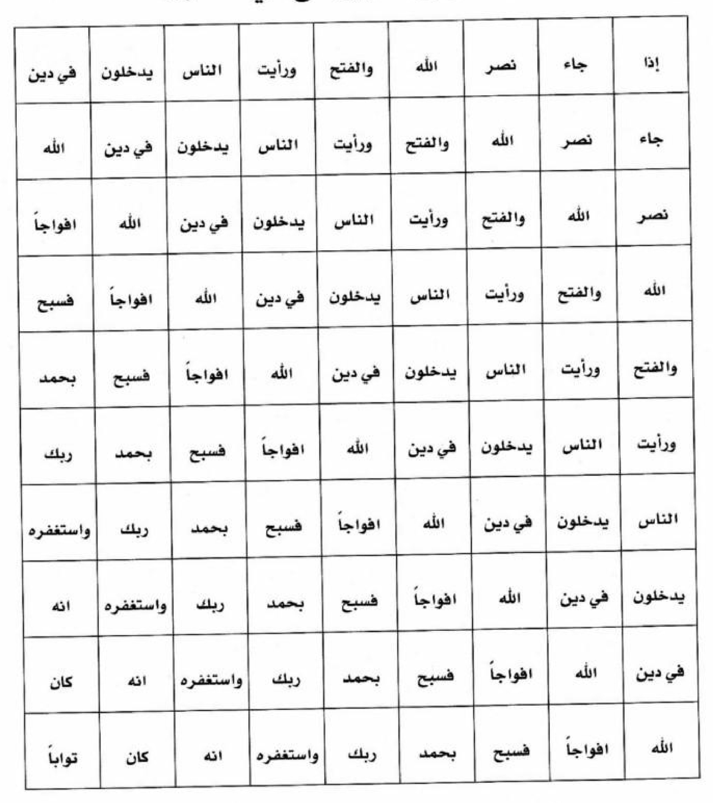

## Halaman PDF 59 (= cetak 71) — THILASM LITHARDIT-TAABI'AH WA 'ILAAJI DAA-ITS-TSA'LAB WAL-BUHAQ (tilsam tsa'lab & bercak kulit)

Menurut teks: tilsam ini ditulis pada **kain merah**, dicelup ke **minyak hitam**, lalu **dibakar waktu maghrib**; tempat mengerjakannya di **hammaam (ruang basah)**, setelahnya dibaca **surat Yaasiin** dengan niat kesembuhan — diulang **tujuh hari**. ⚠ (bahan-bakar dalam ruangan — praktik fisiknya berbahaya; kajian cukup memaparkan redaksinya, tanpa mendorong pelaksanaan).

**Bentuk rajah:** bingkai empat sisi; di tepiannya huruf-huruf dan angka-angka melingkar (antara lain di tepi atas dan bawah terbaca deretan angka seperti **١٦٨٣ م و و و** dan **١٦٦٦ ١ د ١ ٤ ٧ ٥** beserta goresan *mimm-miim/maimun* tidak terbaca *(rajah — angka dicatat apa adanya sebagai bahan filologi, bukan dibaca maknanya)*); di dalam bingkai ada **busur garis bertanda** dan deretan huruf-rajah miring. Di tepi kiri (vertikal) tertulis tawakkal:

> *"Tawakkaluu yaa khodaama haadzat-thilsami bi-an tamdhuu 'alaa kulli 'aaridhin wa taabi'atin fii jasadi fulaan ibni fulaanah — al-wahaa al-wahaa — as-saa'ah as-saa'ah."*
> "Laksanakanlah, wahai para khadam tilsam ini: musnahkanlah setiap gangguan dan roh-pengikut dari tubuh si Fulan bin Fulanah — segera, segera, sekarang, sekarang."

**Telaah filologi:** **daa-uts-tsa'lab** (penyakit yang "memakan seperti rubah" — koreng/kusta menahun) dan **buhaq** (bercak kulit) di masa silam digolongkan gangguan ('aaridh). Penggabungan "thord taabi'ah + obat tsa'lab" dalam satu rajah khas kitab mujarrobat. Kajian mencatat fungsi pembacaannya; **tidak disampaikan cara penggunaannya** (bahaya bakar-bakaran; obat kulit masa kini jauh lebih aman).

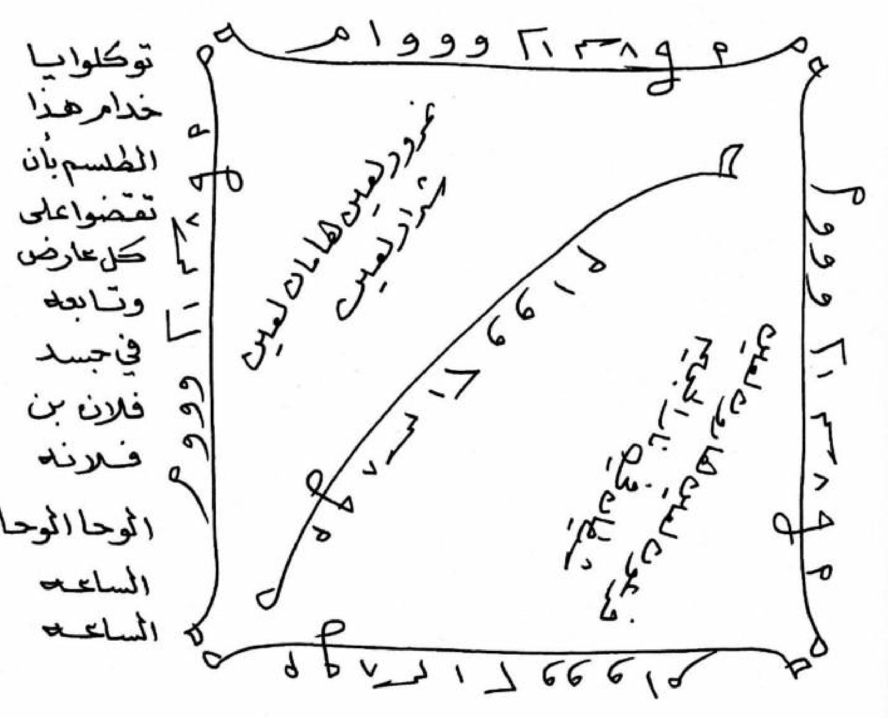

## Halaman PDF 60 (= cetak 73) — AL-FIHRIS (Daftar Isi — halaman pertama)

Daftar isi kitab dimulai di sini (penomoran halaman mengacu halaman cetak — berguna mengaudit terjemahan ini):

| Entri (latin) | Arti | hlm. cetak |
|---|---|---|
| al-Muqaddimah | Mukaddimah | 5 |
| Thilasmun fa'aalun wa mujarrabun li-izaalatil-'aaridh | Tilsam ampuh teruji penanggulang gangguan | 7 |
| Lil-mawaddah wal-mahabbah bainan-naas | Untuk kecintaan antarmanusia | 9 |
| Mujarrabatun fa'aalatun jiddan lil-'izzati 'alazh-zhoolim | Mujarrab sangat ampuh mengalahkan orang zalim | 9 |
| Lil-ghinaa | Untuk kemapanan | 10 |
| Li-raf'il-faqr (mujarrab) | Menyingsingkan kemiskinan | 10 |
| Hijaabun lil-injaab | Hijaab untuk keturunan | 11 |
| Lir-rizq | Untuk rizki | 12 |
| Li-qadhaa-id-dain | Untuk melunasi hutang | 12 |
| **THilasmun li-thardi ummish-shibyaan** | Tilsam penanggulang **Umm ash-Shibyaan** | 13 |
| Li-ibthaalis-sihri wal-'amal | Penangkal sihir dan 'amal (perbuatan gaib) | 15 |

**Telaah filologi:** entri "ummish-shibyaan" mengkonfirmasi nama rajah cetak 13. Daftar isi juga meneguhkan bahwa **hlm. cetak 8, 14 dst. memang bukan pembuka bab baru** (bagian lanjutan), sehingga kesenjangan penomoran terjemahan ini **bukan** kehilangan teks. *(Sambungan fihris di halaman PDF 61–62.)*

---
