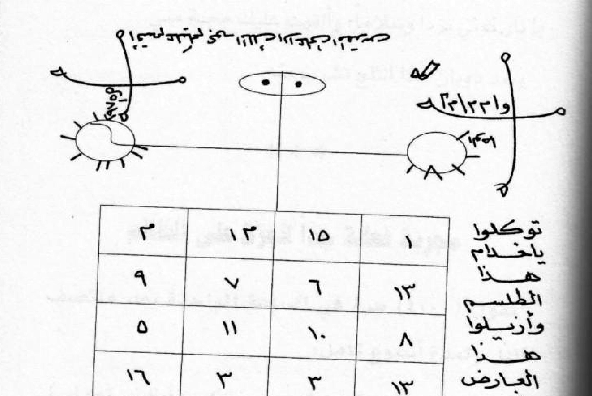

# ASRARUL RUHANIYYAH MIN MUJARROBAT
## Terjemahan Lengkap + Alih-Aksara Latin Pesantren + Rajah Asli
### Kajian Filologi Ruhaniyyah dan Mujarrobat

**Kitab / Sumber digital:** *Asraar Ruuhaniyyah min Mujarrabaat al-'Aalim ar-Ruuhaaniy*, karya **Abu 'Ali asy-Syaibaani** (أبو علي الشيباني), penyunting data Ruuhani: **Ahmad al-'Iraaqi**, Dār al-'Ulūm al-Falakiyyah — dicetak di Lebanon, cetakan pertama. Scan PDF: 67 halaman (= nomor halaman cetak 1–75 pada naskah aslinya; satu halaman PDF = satu halaman cetak).

---

## A. Catatan Metode dan Wasiat

1. **Sifat dokumen ini.** Karya berikut adalah **kajian filologi** atas sebuah naskah ruuhaniyyah/mujarrobat: setiap teks Arab ditranskripsi, dialihaksarakan, dan diterjemahkan sebagaimana tertulis. Isinya **dilaporkan, bukan dianjurkan**. Tidak ada langkah praktik yang merinci cara menyakiti orang lain (*ḍhoror*); bila suatu bab dalam naskah menyebut cara yang membahayakan, bagian itu tetap diterjemahkan sebagai dokumen teks tetapi tanpa panduan teknis yang bisa diikuti.
2. **Wasiat penulis kitab.** Kitab ini digolongkan mujarrobat "khāliyah min as-siḥr wasy-syu'ūdzah" (bebas dari sihir dan syirik menurut penulisnya) dan dibawa dengan wasiat **"Lâ tasta'milhu illâ fî mâ yurḍhî Allâ"** — *janganlah menggunakannya kecuali dalam hal yang diridhai Allah*. Setiap pembacaan harus berada dalam bingkai wasiat tersebut.
3. **Konvensi alih-aksara (Latin pesantren).** Vokal panjang: **ā, ī, ū**; konsonan: *ts sy ṣ ḍ ṭ ẓ kh dh gh q ḥ*; hamzah: `'`; 'ain: `ʿ` (ditulis `'` dalam lafaz umum seperti *ra'ūf*); ta' marbūṭah: *h*. Angka Arab-India ditulis angka Latin (١٥ → 15).
4. **Kode huruf dan angka rajah.** Rajah/thilasm di dalam kitab memuat huruf-huruf terputus (*ḥurūf muqaṭṭa'ah*) dan bilangan — misalnya *ط ٥ ١٨٨١* — sesuai tradisi ilmu huruf ('ilmu al-ḥurūf) dan ilmu bilangan ('ilmu al-a'dād). Kode-kode itu **ditranskripsi persis** lalu diberi **pembacaan teksual** dan penjelasan tradisi (padanan abjzad, ṣighah tawakkul para khadam, dst.) tanpa menjadikannya rumusan yang harus diikuti.
5. **Rajah asli.** Setiap halaman yang memuat rajah, wafaq (kotak angka), atau thilasm diberi tautan ke potongan gambar aslinya (300 dpi, latar putih) di folder `rajah/`, diberi keterangan *"Gambar Rajah Asli Halaman …"*. Versi utuh tiap halaman ada di `gambar_asli/asrar_pNNN.jpg` supaya huruf Arab tidak tampil sebagai kotak hitam pada peranti seluler (karena itu terjemah memakai Latin pesantren sebagai medium utama, Arab hanya sebagai pelengkap).
6. **Struktur halaman.** Skala peta halaman: 1 halaman PDF = 1 halaman cetak. Judul bab dari setiap halaman dicantumkan; bila halaman meneruskan satu bab, ditulis *"(lanjutan bab …)"*.
7. **Lafaz Al-Qur'an.** Ayat yang dikutip diberi tanda *«…»* beserta makna dan rujukan surah:ayat.

**Tafāḍul:** tidak ada jaminan khasiat majarib (percobaan) berikut — dokumen ini untuk dibaca sebagai **karya literatur rohani**, bukan sebagai panduan yang harus dikerjakan.

---

## B. Daftar Istilah (Glosarium Ruhaniyyah & Mujarrobat)

| Istilah | Arti / pembacaan |
|---|---|
| **thilasm / ṭilasm (طلسم)** | gambar berisi huruf terputus, angka, dan lambang ruhani; ditulis untuk dibawa, digantung, atau dibakar sesuai bacaan |
| **wafaq (وفق)** | kotak angka (persegi ruhani), umumnya 3×3 atau 4×4; baris, kolom, diagonal |
| **rajah (رجح)** | gambar ruhani secara umum; di sini dipakai untuk semua lukisan susunan huruf/angka |
| **ḥurūf muqaṭṭa'ah (حروف مقطعة)** | huruf-huruf terputus, misalnya *ط هـ ع س ق*; juga nama kelompok huruf pembuka surah |
| **khatam (خاتم)** | "meterai" ruhani: susunan nama, huruf, atau lambang yang ditutupi bacaan tertentu |
| **janlubīnah / janlabīnah (جلب) ** | memikat hati, menarik datangnya kasih, rezeki, atau tamu |
| **ḥijāb (حجاب)** | tulisan ruhani yang dijadikan pelindung atau untuk hajat khusus (di dalam kitab: untuk kesuburan, dsb.) |
| **khadam (خدام)** | roh-roh bawahan/pelaksana suatu rajah menurut tradisi kitab; dipanggil dengan ṣighah tawakkul |
| **tawakkul (توكلوا)** | kalimat titah: *tawakkalū yā khadam…* — "laksanakanlah, wahai para pelayan (rajah) ini…" |
| **mujarrab** | "yang sudah dicoba/diwakafkan", tanda bahwa suatu lafaz pernah dipakai secara turun-temurun |
| **al-ʿāriḍ (العارض)** | gangguan sementara: penyakit, kesurupan ringan, atau penghalang yang muncul tiba-tiba |
| **al-buḥūr (البخور)** | asap dupa/jenawi untuk "menguapi" thilasm ketika dibaca |
| **zajr (زجر)** | menta'zir/menggertak roh pengganggu supaya pergi |
| **raml (رمل)** | tatakan atau coretan jejak garis sebagai media tuah |
| **ḥirz (حِرز)** | yazimat pelindung badan |

---

## C. Halaman Sampul (PDF ke-1)

> Gambar asli: [asrar_p001.jpg](gambar_asli/asrar_p001.jpg)

**Teks sampul lengkap (Arab gundul):**

Pita merah: **يطبع لأول مرة**

Judul: **أسرار روحانية**

Dari: **من مجربات العالم الروحاني**

Karya: **أبو علي الشيباني**

Baliho merah:
**يحتوي هذا الكتاب**
**علاجات روحانية فعالة وناجحة خالية من السحر والشعودة**
**علاجات طبية مجربة بالأعشاب والآيات والسور القرآنية**

Penyusun: **اعداد الروحاني أحمد العراقي**

Penerbit: **دار العلوم الفلكية — طبع في لبنان**

**Alih-aksara Latin pesantren:**

- *yuṭbaʿ li-auwali marrah* — dicetak untuk pertama kali.
- *Asrāru rūḥāniyyah* — Rahasia-rahasia ruhani.
- *min mujarrabāti al-ʿālimi al-rūḥānī* — dari kumpulan yang telah teruji (mujarrobat) milik tokoh ruhani.
- *Abū ʿAliyy asy-Syaibānī* — karya Abū ʿAlī asy-Syaibānī.
- *yaḥtawī hādzal-kitāb* — kitab ini berisi:
- *ʿilājāt rūḥāniyyah faʿʿālah wa-nājiḥah, khāliyah min as-siḥri wasy-syuʿūdzah* — ilaj/pengobatan ruhani yang ampuh dan berhasil, bersih dari sihir dan syirik.
- *ʿilājāt ṭibbiyyah mujarrabah bi-al-aʿsyāb wal-āyāti was-suwar al-qurʾāniyyah* — pengobatan medis yang telah teruji dengan herba (tumbuhan), ayat-ayat, dan surah-surah Al-Qur'an.
- *iʿdād ar-rūḥānī Aḥmad al-ʿIrāqī* — disusun oleh ar-rūḥānī Aḥmad al-ʿIrāqī.
- *Dār al-ʿUlūm al-Falakiyyah — ṭubiʿa fī Lubnān* — Dār al-ʿUlūm al-Falakiyyah (Percetakan Ilmu Falak), dicetak di Lebanon.

**Terjemahan ringkas:** *Rahasia-Rahasia Ruhani* — dari kumpulan yang telah teruji milik tokoh ruhani Abū ʿAlī asy-Syaibānī. Kitab ini berisi ilaj ruhani yang ampuh dan berhasil (menurut penulisnya), bebas dari sihir dan syirik, serta ilaj medis mujarrab dengan herba dan dengan ayat-ayat/surah Al-Qur'an. Ditata oleh ar-Rūḥānī Aḥmad al-ʿIrāqī, Dār al-ʿUlūm al-Falakiyyah, Lebanon.

**Catatan filologi sampul:** sampul bergambar labu laba-laba (al-ḥalzūn) dan sisir bawang — tanda-tanda bahwa kandungannya sebagian besar "ilaj aʿsyāb" (herba), sesuai iklan baliho. Ornamen shamsiyyah (medali matahari bertatahan) di kanan adalah hiasan percetakan; tidak membawa bacaan ruhani.

---
---

## Halaman cetak 7 (PDF ke-2)

> Gambar asli: [asrar_p002.jpg](gambar_asli/asrar_p002.jpg)

### طلسم فعال ومجرب لإزالة العارض — Thilasm yang ampuh dan mujarrab untuk mengangkat *ʿāriḍ* (gangguan sementara)

**Arab (gundul):**

تكتب هذا الطلسم بقلم اسود على قطعة قماش بيضاء من ملابس الشخص المصاب وتحرق هذه القطعة كي يتبخر بها.

**Latin pesantren:**

*tukṭab hādzal-ṭilasm bi-qalam aswad ʿalā qaṭʿah qamāsy baiḍāʾ min malābis asy-syakhṣ al-muṣāb, wa-tuḥraq hādzihil-qiṭʿah kay yatabakhkhar bihā*

**Terjemahan:** Dilaporkan dalam naskah: thilasm ini ditulis dengan pena hitam pada potongan kain putih dari pakaian orang yang terkena; potongan kain itu dibakar agar (asapnya) menyelimuti orang tersebut.

#### Rajah + wafaq halaman 7

**Penjelasan rajah (deskriptif):** Rajah berupa dua lingkaran mirip matahari/yin-yang di kiri dan kanan, dihubungkan garis melintang dengan dua "mata" (+Simbol oval berisi dua titik) di tengah atas; di sekelilingnya tersebar huruf-huruf terputus dan kode angka yang terbaca antara lain di tiang kiri *٢٣٣١٣٥ (23-31-35)* dan tiang kanan *و اد ا ٢١٣٥ هـ* — susunan seperti ini dalam tradisi kitab dibaca sebagai "kunci" huruf dan bilangan, bukan kalimat berbahasa. Di bawahnya wafaq 4×4 berisi (dari kanan atas): **١ ١٥ ١٣ ٣ / ١٣ ٦ ٧ ٩ / ٨ ١٠ ١١ ٥ / ١٦ ٣ ٣ ١٢** (masing-masing baris berjumlah 32; susunan tidak konsisten simetris khas *wafaq majīrah* naskah ini).

**Bacaan menyertai (di samping dan di bawah wafaq):**

**Arab:** توكلوا يا خدام هذا الطلسم وأزيلوا هذا العارض في جسد فلان بن فلان. أقسم عليكم بحق الملك الأعلى المسلّط عليكم.

**Latin:** *tawakkalū yā khadama hādzal-ṭilasm wa-azīlū hādzal-ʿāriḍ fī jasadi fulān ibn fulān. uqsimu ʿalaikum bi-ḥaqqil-maliki al-aʿlā al-musallaṭi ʿalaikum.*

**Terjemahan:** "Laksanakanlah, wahai para pelayan thilasm ini, dan lenyapkanlah gangguan ini dari tubuh si (nama orangnya); aku bersumpah atas kalian demi hak al-Malik al-Aʿlā (Sang Raja Yang Mahatinggi) yang menguasai kalian." — *Catatan:* frasa *fulān ibn fulān* (".si ini bin/putra si ini") adalah tempat kosong untuk nama; dalam kajian ini dibiarkan apa adanya sesuai naskah.

---
---

## Halaman cetak 9 (PDF ke-3)

> Gambar asli: [asrar_p003.jpg](gambar_asli/asrar_p003.jpg)

### للمودة والمحبة بين الناس — Untuk cinta-kasih dan kasih masyarakat

**Arab:**

تكتب على قالب من الثلج بقلم بدون حبر الآتي:
سلام قولاً من رب رحيم، سلام على آل ياسين (٩) مرات،
يا نار كوني برداً وسلاماً، وألقيت عليك محبة مني.
وبعد ذوبان هذا الثلج تشرب منه.

**Latin:** *tukṭab ʿalā qālib minaṣ-tsalj bi-qalam bidūn ḥibr al-ātī: salāmun-qaulan min rabbi raḥīm; salāmun ʿalā āli yāsīn* (9 kali) — *yā nār kūnī bardan wa-salāman, wa-ulqītu ʿalaika maḥabbatan minnī. wa-baʿdu dzawbāni hādzats-tsalji tusyribu minhu.*

**Terjemahan:** Naskah menganjurkan (dilaporkan): menulis pada bongkahan es dengan pena tanpa tinta: *"Salām — satu ucapan dari Tuhan Yang Maha Pengasih; kedamaian atas keluarga Yāsīn"* dibaca 9 kali, dan *"Wahai api, jadilah Engkau dingin dan selamat; dan Aku turunkan padamu cinta dari-Ku."* Setelah es itu mencair, airnya diminum.

**Catatan:** *"salāmun qaulan min rabbi-rraḥīm"* = Yā Sīn : 58. *"yā nār kūnī bardan wa-salāman"* menggemakan potongan Al-Anbiyā' : 69 (pertolongan Allah kepada Ibrahim); *"ulqītu ʿalaika maḥabbatan minnī"* = Ṭā Hā : 39 (Firman kepada Musa). Redaksi ini menyalin ayat secara parsing; kitab memakainya sebagai lafaz damba dan bukan bacaan ibadah wajib.

\*\*\*

### مجربة فعالة جداً للعزة على الظالم — (Telur percobaan yang sangat ampuh untuk mengalahkan orang yang zalim)

**Arab:** تقول (٤٠٠) مرة في الساعة الواحدة بعد منتصف الليل ولمدة أسبوع كامل: (ومن مثلي وأين يكون مثلي، وليس نصري إلا الله، ولا يُحجب عنه الحق تجدني)

**Latin:** *taqūlu* 400 kali dalam satu jam sesudah tengah malam selama satu pekan penuh: *wa-man miṡlī, wa-aina yakūnu miṡlī, wa-laisa naṣrī illā Allāh, wa-lā yuḥjaba ʿanhu al-ḥaqq tajdanī.*

**Terjemahan:** Menurut naskah, dibacakan 400 kali dalam satu jam selepas tengah malam selama sepekan: *"Siapa yang seperti aku, dan di mana ada yang seperti aku? Tidak ada penolongku kecuali Allah; dan kebenaran tidak akan tertutupi dari-Nya — engkau akan menemukaniku."* **Catatan kajian:** lafaz ini termasuk golongan "lafaz ta'ājub"/heran-kagum pada Qudrat Allah; klausa-klusanya berbunyi semu dan susunannya tidak standar — itulah salah satu alasan genre "mujarrobat" dinilai menyimpang oleh banyak ulama, maka di sini cukup didokumentasikan, **bukan untuk dilatih**.

---
---

## Halaman cetak 10 (PDF ke-4)

> Gambar asli: [asrar_p004.jpg](gambar_asli/asrar_p004.jpg)

### للغنى — Untuk kemapanan (melepaskan diri dari miskin)

**Arab:**

تقرأ هذا الدعاء:
يا معيد إذا برز الخلائق من دعوته من مخافته، يا ذا المعروف الذي لا ينقطع.
اللهم دلني على كريم غيرك، اللهم دلني على عظيم غيرك وكل شيء بين يديك.
ثم تقرأ (سورة مريم) بأكملها وتهديها إلى السيدة مريم بنت عمران (ع).

**Latin:** *taqrau hādzal-duʿāʾ: yā muʿīd idzā baraṥal-khalāʾiq min daʿwatihi min makhāfatih, yā dzal-maʿrūf al-ladzī lā yanqaṭiʿ. Allāhumma dillinī ʿalā karīmin ghairuk; Allāhumma dillinī ʿalā ʿaẓīmin ghairuk, wa-kullu syaiʾ baina yadaik. tsumma taqrau (sūrata Maryam) bi-akmalihā wa-tuhdīhā ilā as-sayyidah Maryam binti ʿImrān ʿalaiha as-salām.*

**Terjemahan:** Menurut naskah: bacakan doa ini — *"Wahai Yang membangunkan kembali tatanan makhluk setelah kemusnahan, wahai Yang mewahyukan (taqwā) sebab menggemari amal kebajikan yang tidak terputus! Ya Allah, tunjukilah aku jalan kepada Yang Mulia selain-Mu! Ya Allah, tunjukilah aku jalan kepada Yang Agung selain-Mu; dan segala sesuatu berada di tangan-Mu."* Kemudian dibacakan *sūrah Maryam* seluruhnya dan pahalanya dipersembahkan kepada Sayyidah Maryam binti ʿImrān, salawatullah ʿalaihā. **Catatan:** mengikhtiarkan (menghadiahkan bacaan) merupakan sudut mujarrobat yang khas di kalangan tradisi lembut (ruuhani — nonajah/hikmah); isinya murni tawassul dan zikir.

\*\*\*

### لرفع الفقر (مجرب) — Untuk menyingsingkan kemiskinan (mujarrab)

**Arab:**

تقول (١٠٠) مرة في الساعة الواحدة بعد منتصف الليل ولمدة أسبوع واحد:
(أتعرف من له اسماً كأسمي أنا الرحمن اطلبني تجدني)
بعدها تسجد وتقول وانت ساجد (١٠٠) مرة (اللهم غير سوء …

**Latin:** *taqūlu* 100 kali dalam satu jam sesudah tengah malam satu pekan: *a-taʿrifu man lahu isman ka-ismī? anā ar-Raḥmān — uṭlubnī tajidnī*; setelahnya sujud dan mengucapkan ketika sujud 100 kali *Allāhumma ghairra sauʾ … (lanjut ke halaman 11)*

**Terjemahan:** Lafaz yang dirinci naskah: *"Tahukah engkau siapa yang memiliki nama seperti nama-Ku? Akulah ar-Raḥmān; mintalah kepada-Ku — niscaya engkau menemukan Aku."* Setelah membaca itu, bersujud sambil membaca (100 kali) *"Ya Allah, ubahlah keburukan … (bersambung)".* **Catatan filologi:** ungkapan "tahukah engkau siapa yang bernama seperti nama-Ku" ialah *kalām waṣfī* (pernyataan tentang keagungan Asma' ar-Raḥmān), bukan kutipan ayat literal; wujudnya yang menyena bergambar menunjukkan corak retorika hikmah yang menyentuh bait (sebagaimana lafaz ta'ajjub di atas).

---
---

## Halaman cetak 11 (PDF ke-5)

> Gambar asli: [asrar_p005.jpg](gambar_asli/asrar_p005.jpg)

**(Lanjutan bab "Untuk menyingsingkan kemiskinan")**

**Arab:**

… حالي بحسن حالك) ، (٢١) مرة (يارحيم) ، ثم تمسح وجهك وجسمك بيديك.

**Latin:** *… ḥālī bi-ḥusni ḥālak* (melengkapi *Allāhumma ghayyir sauʾa ḥālī bi-ḥusni ḥālak*), 21 kali *yā raḥīm*; kemudian mengusapkan kedua tangan ke wajah dan badan.

**Terjemahan (lanjutan):** "… keadaanku dengan kebaikan keadaan-Mu"; dibacakan *yā raḥīm* 21 kali, lalu kedua tangan diusapkan ke wajah dan tubuh (sebagaimana lazim usai berdoa).

\*\*\*

### حجاب للإنجاب — Ḥijāb (pelindung-do'a ruhani) untuk mendapatkan keturunan

**Arab:**

يكتب الزوجان هذا الحجاب بالمسك والزعفران على ورقة بشرط أن يكونا صائمين في ذلك اليوم، وقته قبل الفطور:
(إن الله لا يخلف الميعاد) كما قال الله تعالى (ولو أن قرآناً سيِّرت به الجبال أو قطِّعت به الأرض أو كلِّم به الموتى بل لله الأمر جميعاً) بحق (والسماء والطارق وما أدراك ما الطارق النجم الثاقب إن كل نفس لما عليها حافظ فلينظر الإنسان مما خلق خلق من ماء دافق يخرج من بين الصلب والترائب) فالله خير حافظ وهو ارحم الراحمين.
يحمل كل من الزوجين هذا الحجاب ويربطه بجسمه لمدة أربعين يوماً بشرط ألا يضيع.

**Latin pesantren:** *yuktab az-zaujāni hādzal-ḥijāb bil-misk waz-zaʿfarān ʿalā waraqah, bi-syarṭ an yakūnā ṣāʾimain fī dzālika al-yaum, waqtuhu qablal-fuṭūr: «innallāha lā yukhliful-mīʿād» kamā qāla Allāhu taʿālā: «walau anna qurʾānan suyyirat bihi al-jibāl au quṭṭiʿat bihi al-arḍu au kullima bihi al-mautā — bal lillāhi al-amru jamīʿā», bi-ḥaqqi «was-samāʾi waṭ-ṭāriq, wa-mā adrāka maṭ-ṭāriq, an-najmu ts-tsāqib — in kullu nafsin lammā ʿalaihā ḥāfiẓ, falyanẓur al-insānu mimmā khuliq: khuliqa min māʾ dāfiq, yakhruju min baini aṣ-ṣulbi wat-tarāʾib», fallāhu khairun ḥāfiẓan wa-huwa arḥamu ar-rāḥimīn. yaḥmilu kullun min az-zaujain hādzal-ḥijāb wa-yurbiṭuhu bi-jasadihi muddata arbaʿīna yauman bi-syarṭ allā yuḍīʿuhu.*

**Terjemahan:** Menurut naskah: ḥijāb ini ditulis suami-istri dengan campuran misik dan za'faran pada kertas pada hari keduanya berpuasa, sebelum berbuka — *«Sungguh Allah tidak menyalahi janji»*; demikian Al-Qur'an berbunyi: *«Dan seandainya ada suatu bacaan (kitab) yang dengan bacaan itu gunung-gunung digerakkan atau bumi dipotong-potong atau orang mati diajak bicara (mereka tetap tida percaya); bahkan seluruh perkara kembali kepada Allah»*; kemudian (dilanjutkan) dengan keutus *«Demi langit dan yang datang pada malam hari! Tahukah kamu apa yang datang pada malam hari itu? (Itulah) bintang yang cahayanya menembus. Tiada suatu jiwa pun melainkan ada penjaganya. Maka hendaklah manusia memperhatikan dari apa ia diciptakan: ia diciptakan dari air yang terpancar, yang keluar dari antara tulang sulbi dan tulang dada»* — ditutup: *"maka Allah adalah sebaik-baik Penjaga, dan Dia Maha Pengasih dari semua yang mengasihi."* — suami istri membawa ḥijāb ini diikat ke badan selama 40 hari dengan syarat tidak boleh tersesat/hilang.

**Catatan kajian:** ayat-ayat yang dikutip —
1. Al-Mīʿād (anti-salah janji) — mengingatkan pada bunyi Ar-Raḥmān : ?— sebenarnya tepatnya cuplikan dari *firman* "Lâ yukhlifu-llāhu al-mīʿād" (QS Āl ʿImrān : 194/**ar-Raḥmān** makna senada; dalam naskah ditulis tanpa rujuk).
2. «lau anna qurʾānan suyyirat bihi al-jibāl…» = QS ar-Raʿd : 31.
3. Urutan surah aṭ-Ṭāriq : 1–7 ("was-samāʾi waṭ-ṭāriq … yakhruju min baini aṣ-ṣulbi wat-tarāʾib").
Penyambungan ayat dalam satu untaian seperti ini wajar dalam genre ḥijāb hikmah; dalam kajian filologi, segi susunannya dicatat apa adanya, dan **tidak ditafsirkan menjadi tata cara yang harus dilakukan** — tingkat validitasnya diserahkan kepada masing-masing pembaca sesuai tuntunan agama masing-masing.

---
---

*Khatam Batch 1 (PDF ke-1 s.d. ke-5 · sampul + halaman cetak 7, 9, 10, 11 · 1 rajah dipotong). Lanjut Batch 2: PDF ke-6 s.d. ke-10 (halaman cetak 13, 14, 18, 20, 21).*
